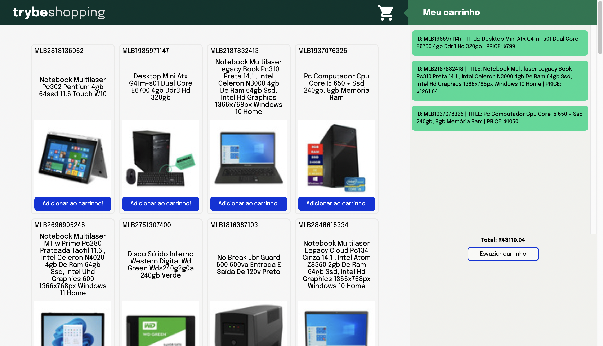
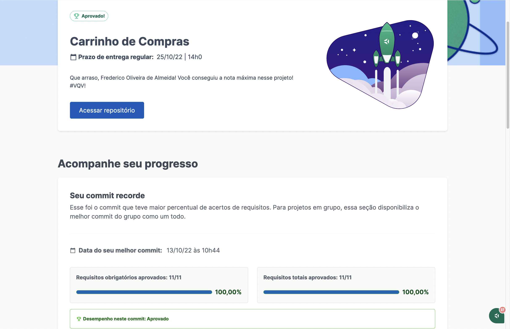

# Demo




---
# Requisitos Obrigatórios

⚠️ **Atenção:** Ao criar novas funções para resolver os requisitos, faça as implementações **sempre** dentro do arquivo `script.js`.

## 1. (TDD) Desenvolva testes de no mínimo 25% de cobertura total e 100% da função `fetchProducts`

<details>
  <summary>
    Implemente os testes necessários na função <code>fetchProducts</code>
  </summary> <br />

O arquivo para implementar o teste já está criado, se chama `fetchProducts.test.js` e se encontra dentro da pasta `tests`.

**O que você deve testar:**

- Teste se `fetchProducts` é uma função;

- Execute a função `fetchProducts` com o argumento `'computador'` e teste se `fetch` foi chamada;

- Teste se, ao chamar a função `fetchProducts` com o argumento `'computador'`, a função `fetch` utiliza o endpoint `'https://api.mercadolibre.com/sites/MLB/search?q=computador'`;

- Teste se o retorno da função `fetchProducts` com o argumento `'computador'` é uma estrutura de dados igual ao objeto `computadorSearch`, que já está importado no arquivo.

- Teste se, ao chamar a função `fetchProducts` sem argumento, retorna um erro com a mensagem: `'You must provide an url'`.

> **De olho na dica 👀:** Lembre-se de usar o `new Error('mensagem esperada aqui')` para comparar com o objeto retornado da API.
> Leia com bastante atenção o que está sendo solicitado e implemente um teste de cada vez!

⚠️ **Atenção:** Você deve implementar todos os testes acima, independente do que for suficiente para a cobertura de testes.

**O que será testado:**

- Será avaliado se os testes implementados atingem no mínimo 25% da cobertura total e 100% da função `fetchProducts`.

</details>

## 2. Crie uma listagem de produtos

<details>
  <summary>
    Utilize a função <code>fetchProducts</code> para criar uma listagem de produtos através da API do Mercado Livre.
  </summary> <br />

O arquivo da função `fetchProducts` já está criado e se encontra dentro da pasta `helpers` e já está sendo importado dentro do arquivo HTML.

A função `fetchProducts` deverá ser responsável por realizar a requisição e retornar os resultados da API.

Implemente a função `fetchProducts`;

- Utilize o _endpoint_ `https://api.mercadolibre.com/sites/MLB/search?q=$QUERY`, onde:

  - O valor de `$QUERY` representa o termo que será buscado na API, esse valor deve ser **obrigatoriamente** o termo `computador`;

  - O retorno de produtos se encontra no array `results`;

<details>
<summary>Clique aqui para ver o retorno da API</summary>

```json
{
  "site_id": "MLB",
  "country_default_time_zone": "GMT-03:00",
  "query": "computador",
  "paging": {...},
  "results": [
    {
      "id": "MLB2025368730",
      "site_id": "MLB",
      "title": "Computador Completo Fácil Intel Core I3 8gb Ssd 240gb ",
      "seller": {},
      "price": 1859.07,
      "prices": {},
      "sale_price": null,
      "currency_id": "BRL",
      "available_quantity": 100,
      "sold_quantity": 500,
      "buying_mode": "buy_it_now",
      "listing_type_id": "gold_pro",
      "stop_time": "2041-09-12T04:00:00.000Z",
      "condition": "new",
      "permalink": "https://produto.mercadolivre.com.br/MLB-2025368730-computador-completo-facil-intel-core-i3-8gb-ssd-240gb-_JM",
      "thumbnail": "http://http2.mlstatic.com/D_704139-MLB47542929423_092021-I.jpg",
      "thumbnail_id": "704139-MLB47542929423_092021",
      "accepts_mercadopago": true,
      "installments": {},
      "address": {},
      "shipping": {},
      "seller_address": {},
      "attributes": [],
      "differential_pricing": {},
      "original_price": 1999,
      "category_id": "MLB1649",
      "official_store_id": 3807,
      "domain_id": "MLB-DESKTOP_COMPUTERS",
      "catalog_product_id": null,
      "tags": [],
      "order_backend": 1,
      "use_thumbnail_id": true,
      "offer_score": null,
      "offer_share": null,
      "match_score": null,
      "winner_item_id": null,
      "melicoin": null,
      "discounts": null
    },
    // {...} restante da lista de produtos
  ],
  "sort": {...},
  "available_sorts": {...},
  "filters": {...},
  "available_filters": {...}
}

```
</details>

Para executar sua função `fetchProducts` basta chama-lá no seu arquivo `script.js`.

---

Com os dados em mãos, você deverá utilizar a função `createProductItemElement()` para criar os componentes _HTML_ referentes a cada um dos produtos retornados pela API:
> Essa função já está implementada no `script.js`
  - Adicione cada elemento retornado da função `createProductItemElement(product)` como filho do elemento `<section class="items">`.

**O que será testado:**

- O elemento com classe `.item` deve ser cada item da lista de produtos.

</details>

## 3. (TDD) Desenvolva testes de no mínimo 50% de cobertura total e 100% da função `fetchItem`

<details>
  <summary>
    Implemente os testes necessários na função <code>fetchItem</code>
  </summary> <br />

**O que você deve testar:**

- Teste se `fetchItem` é uma função;

- Execute a função `fetchItem` com o argumento do item "MLB1615760527" e teste se `fetch` foi chamada;

- Teste se, ao chamar a função `fetchItem` com o argumento do item "MLB1615760527", a função `fetch` utiliza o endpoint "https://api.mercadolibre.com/items/MLB1615760527";

- Teste se o retorno da função `fetchItem` com o argumento do item "MLB1615760527" é uma estrutura de dados igual ao objeto `item` que já está importado no arquivo.

- Teste se, ao chamar a função `fetchItem` sem argumento, retorna um erro com a mensagem: `'You must provide an url'`.

> **De olho na dica 👀:** Lembre-se de usar o `new Error('mensagem esperada aqui')` para comparar com o objeto retornado da API.
> Leia com bastante atenção o que está sendo solicitado e implemente um teste de cada vez!

**O que será testado:**

- Será avaliado se os testes implementados atingem no mínimo 50% da cobertura total e 100% da função `fetchItem`.

</details>

## 4. Adicione o produto ao carrinho de compras

<details>
  <summary>
    Implemente a função <code>fetchItem</code> para retornar dados de um produto e adicioná-lo ao carrinho.
  </summary> <br />

Cada produto na página _HTML_ possui um botão com o nome `Adicionar ao carrinho` e, ao clicar nesse botão, você deve realizar uma requisição que vai retornar todos os detalhes de um produto.

- Implemente a função `fetchItem` para fazer a requisição dos detalhes de apenas **um** produto;

- Utilize o _endpoint_ `https://api.mercadolibre.com/items/$ItemID`, onde `$ItemID` é o `id` do produto a ser buscado;

- Utilize a função `createCartItemElement()` para criar os componentes _HTML_ referentes a um item do carrinho;

- Adicione o elemento retornado da função `createCartItemElement(product)` como filho do elemento `<ol class="cart__items">`.

Por exemplo, se o `id` do produto for `MLB1341706310`, o retorno do _endpoint_ será algo no formato:

<details>
<summary><strong>Clique aqui para ver o retorno da API</strong></summary>

```json
{
    "id": "MLB1341706310",
    "site_id": "MLB",
    "title": "Processador Amd Ryzen 5 2600 6 Núcleos 64 Gb",
    "subtitle": null,
    "seller_id": 245718870,
    "category_id": "MLB1693",
    "official_store_id": 1929,
    "price": 879,
    "base_price": 879,
    "original_price": null,
    "currency_id": "BRL",
    "initial_quantity": 0,
    "available_quantity": 0,
    "sold_quantity": 0,
    //[...]
    "warranty": "Garantia de fábrica: 3 anos",
    "catalog_product_id": "MLB9196241",
    "domain_id": "MLB-COMPUTER_PROCESSORS",
    "parent_item_id": null,
    "differential_pricing": null,
    "deal_ids": [],
    "automatic_relist": false,
    "date_created": "2019-10-15T18:13:00.000Z",
    "last_updated": "2019-12-20T18:06:54.000Z",
    "health": null,
    "catalog_listing": true
}
```
</details>

**O que será testado:**

- O elemento com classe `.cart__items` deve adicionar o item escolhido, apresentando corretamente suas informações de id, título e preço.

</details>

## 5. Remova o item do carrinho de compras ao clicar nele

<details>
  <summary>
    Ao clicar no <strong>produto no carrinho de compra</strong>, ele deve ser removido da lista.
  </summary> <br />

Ao clicar em um dos itens do carrinho de compras, esse item deve ser removido da lista. Para isso:

**O que será testado:**

- Remova o item do carrinho de compras ao clicar nele;

</details>

## 6. (TDD) Desenvolva testes de no mínimo 75% de cobertura total e 100% da função `saveCartItems`

<details>
  <summary>
    Implemente os testes necessários na função <code>saveCartItems</code>
  </summary> <br />

O arquivo para implementar o teste já está criado, se chama `saveCartItems.test.js` e se encontra dentro da pasta `tests`.

⚠️ **Atenção:** Não altere a estrutura já implementada nos arquivos de testes, apenas adicione os testes dentro do bloco `describe`.

**O que você deve testar:**

- Teste se, ao executar `saveCartItems` com um `cartItem` como argumento, o método `localStorage.setItem` é chamado;

- Teste se, ao executar `saveCartItems` com um `cartItem` como argumento, o método `localStorage.setItem` é chamado com dois parâmetros, sendo o primeiro a chave 'cartItems' e o segundo sendo o valor passado como argumento para `saveCartItems`.

⚠️ **Atenção:** Você deve implementar todos os testes acima, independente do que for suficiente para a cobertura de testes.

**O que será testado:**

- Será avaliado se os testes implementados atingem no mínimo 75% da cobertura total e 100% da função `saveCartItems`.

</details>

## 7. (TDD) Desenvolva testes para atingir 100% de cobertura total e 100% da função `getSavedCartItems`

<details>
  <summary>
    Implemente os testes necessários na função <code>getSavedCartItems</code>
  </summary> <br />

O arquivo para implementar o teste já está criado, se chama `getSavedCartItems.test.js` e se encontra dentro da pasta `tests`.

⚠️ **Atenção:** Não altere a estrutura já implementada nos arquivos de testes, apenas adicione os testes dentro do bloco `describe`.

**O que você testar:**

- Teste se, ao executar `getSavedCartItems`, o método `localStorage.getItem` é chamado;

- Teste se, ao executar `getSavedCartItems`, o método `localStorage.getItem` é chamado com o 'cartItems' como parâmetro.

⚠️ **Atenção:** Você deve implementar todos os testes acima, independente do que for suficiente para a cobertura de testes.

**O que será testado:**

- Será avaliado se os testes implementados atingem 100% da cobertura total e 100% da função `getSavedCartItems`.

</details>

## 8. Carregue o carrinho de compras ao iniciar a página

<details>
  <summary>
    Salve os itens adicionados no carrinho de compras no <code>localStorage</code>
  </summary> <br />

Ao carregar a página, o estado atual do carrinho de compras deve ser carregado do **LocalStorage**. Para que isso funcione, os itens do carrinho de compras devem ser salvos no **LocalStorage**, ou seja, a **adição** e **remoção** de um produto devem ser abordadas para que a lista esteja sempre atualizada.

Para isso, você terá de implementar as funções `saveCartItems` e `getSavedCartItems` que já estão criadas com o nome `saveCartItems.js` e `getSavedCartItems.js`, respectivamente, dentro da pasta `helpers`.

- Implemente a função `saveCartItems` que deve possuir a lógica para apenas **adicionar** o item no `localStorage` em uma chave chamada `cartItems`;

- Implemente a função `getSavedCartItems` que deve possuir a lógica para apenas **retornar** o item do `localStorage`.

⚠️ A função `saveCartItems` **não** deve recuperar os itens do `localStorage`. A função `getSavedCartItems` **não** deve adicionar um item no `localStorage`.

**O que será testado:**

- A página ao ser atualizada deve permanecer com todos os itens do carrinho adicionados anteriormente.

</details>

## 9. Calcule o valor total dos itens do carrinho de compras

<details>
  <summary>
    O elemento com o valor <strong>total</strong> dos produtos deve possuir a classe <code>total-price</code>
  </summary> <br />

Cada vez que o carrinho de compras é modificado, será necessário calcular o valor total dos produtos e apresentá-los na página principal do projeto. Para isso:

- Implemente uma lógica para somar todos os produtos do carrinho;

- Crie um elemento com a classe `total-price` e adicione o texto com o valor total dos produtos;

> **Lembre-se 💭:** Ao adicionar um produto no carrinho é realizada uma requisição para a API. Certifique-se de que a API já retornou as informações antes de realizar a soma dos produtos.

> **De olho na dica 👀:** Não utilize o `toFixed()`, encontre outras alternativas para arredondar valores.

**O que será testado:**

- Calcule o valor total dos itens do carrinho de compras de forma assíncrona;

</details>

## 10. Limpe o carrinho de compras

<details>
  <summary>
    Implemente a lógica no botão <code>Esvaziar carrinho</code> para limpar o carrinho de compras
  </summary> <br />

O botão para esvaziar o carrinho já está implementado, mas ele ainda não cumpre seu objetivo. Para isso:

- Certifique-se que o botão possui **obrigatoriamente** a classe `empty-cart`;

- Implemente a lógica para remover **todos** os itens do carrinho de compras;

**O que será testado:**

- Verifica o botão para limpar carrinho de compras;

</details>

## 11. Adicione um texto de `carregando` durante uma requisição à API

<details>
  <summary>
    Adicione um elemento com o texto <code>carregando...</code> durante a requisição à API
  </summary> <br />

Uma requisição à API gasta um certo tempo e durante esse processo a pessoa que está utilizando a página não tem como saber se a requisição deu certo ou não. Por isso, normalmente é utilizada alguma forma para mostrar que a requisição ainda está em andamento. Para isso:

- Crie um elemento que contenha o texto `carregando...`, que deve ser exibido em algum lugar da página;

- Adicione a classe `loading` ao elemento que possui o texto `carregando...`;

- Exiba esse elemento apenas **durante** a requisição à API.

> **De olho na dica 👀:** Você pode criar uma função que adicione ao DOM o elemento com o texto `carregando...` e outra para retirá-lo, o que acha?

**O que será testado:**

- Verifica se adiciona um texto de "carregando" durante uma requisição à API.

</details>
