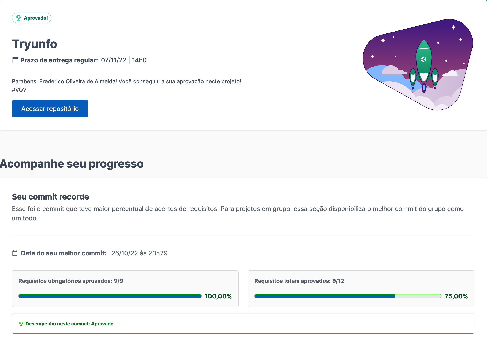

# Demo

---
# Requisitos

:warning: **PULL REQUESTS COM ISSUES DE LINTER NÃO SERÃO AVALIADAS.** :warning:

:warning: Os gifs são meramente ilustrativos para visualizar o fluxo da aplicação. Portanto, os nomes devem seguir os requisitos e não o gif. :warning:

## 1. Crie o formulário que será usado para adicionar cartas ao baralho
Crie um formulário que será utilizado para criar as cartas do seu baralho.

  * Crie um componente chamado `Form` dentro da pasta `src/components`.

  * Renderize o componente `Form` dentro do componente principal `App`. 

  * 

Crie os seguintes itens dentro do component <code>Form</code>:

  
    :bulb: **Dica:** Você pode criar um componente de input. Lembre-se de sempre ter uma label associada para cada input.

    - um campo do tipo `text` que contenha o atributo `data-testid="name-input"`. Este campo será usado para inserir o nome da carta.

    - um campo do tipo `textarea` que contenha o atributo `data-testid="description-input"`. Este campo será usado para inserir a descrição da carta.

    - um campo do tipo `number` que contenha o atributo `data-testid="attr1-input"`. Este campo será usado para inserir o primeiro atributo da carta. Ele é livre para você adicionar o atributo que mais combinar com o seu baralho.

    - um campo do tipo `number` que contenha o atributo `data-testid="attr2-input"`. Este campo será usado para inserir o segundo atributo da carta. Ele é livre para você adicionar o atributo que mais combinar com o seu baralho.

    - um campo do tipo `number` que contenha o atributo `data-testid="attr3-input"`. Este campo será usado para inserir o terceiro atributo da carta. Ele é livre para você adicionar o atributo que mais combinar com o seu baralho.

    - um campo do tipo `text` que contenha o atributo `data-testid="image-input"`. Este campo será usado para inserir o caminho para imagem da carta.

    - um campo do tipo `select` que contenha o atributo `data-testid="rare-input"`. Este campo será usado para inserir a raridade da carta e deverá ter as `options`: `normal`, `raro` e `muito raro` (é importante que as opções estejam nessa ordem).

    - um campo do tipo `checkbox` que contenha o atributo `data-testid="trunfo-input"`. Este campo será usado para inserir se a carta é o Super Trunfo.
    
    - um `button`que contenha o atributo  `data-testid="save-button"` e que tenha o texto "Salvar".
  

  

<strong>Imagem exemplo:</strong>

  

  
 

  
<strong>O que será verificado</strong>
 

  - Será validado se existe um input texto que possui o `data-testid="name-input"`.
  
  - Será validado se existe um input textarea que possui o `data-testid="description-input"`.
  
  - Será validado se existe um input number que possui o `data-testid="attr1-input"`.
  
  - Será validado se existe um input number que possui o `data-testid="attr2-input"`.
  
  - Será validado se existe um input number que possui o `data-testid="attr3-input"`.
  
  - Será validado se existe um input texto que possui o `data-testid="image-input"`.

  - Será validado se existe um input select que possui o `data-testid="rare-input"` com as `options`: `normal`, `raro` e `muito raro`, nesta ordem.

  - Será validado se existe um input checkbox que possui o `data-testid="trunfo-input"`.

  - Será validado se existe um botão que possui o `data-testid="save-button"`.

---

## 2. Adicione as props necessárias ao componente de formulário 

  * 

O componente <code>Form</code> deverá receber as seguintes props:

  
    - `cardName`, uma string;
    - `cardDescription`, uma string;
    - `cardAttr1`, uma string;
    - `cardAttr2`, uma string;
    - `cardAttr3`, uma string;
    - `cardImage`, uma string;
    - `cardRare`, uma string;
    - `cardTrunfo`, um boolean;
    - `hasTrunfo`, um boolean;
    - `isSaveButtonDisabled`, um boolean;
    - `onInputChange`, uma callback;
    - `onSaveButtonClick`, uma callback;
  

  * 

As props do componente <code>Form</code> deverão ser utilizadas conforme o indicado abaixo:

    * Campo `name-input`: o atributo `value` deve receber o valor da prop `cardName` e o atributo `onChange` deve receber o valor da prop `onInputChange`.

    * Campo `description-input`: o atributo `value` deve receber o valor da prop `cardDescription` e o atributo `onChange` deve receber o valor da prop `onInputChange`.

    * Campo `attr1-input`: o atributo `value` deve receber o valor da prop `cardAttr1` e o atributo `onChange` deve receber o valor da prop `onInputChange`.

    * Campo `attr2-input`: o atributo `value` deve receber o valor da prop `cardAttr2` e o atributo `onChange` deve receber o valor da prop `onInputChange`.

    * Campo `attr3-input`: o atributo `value` deve receber o valor da prop `cardAttr3` e o atributo `onChange` deve receber o valor da prop `onInputChange`.

    * Campo `image-input`: o atributo `value` deve receber o valor da prop `cardImage` e o atributo `onChange` deve receber o valor da prop `onInputChange`.

    * Campo `rare-input`: o atributo `value` deve receber o valor da prop `cardRare` e o atributo `onChange` deve receber o valor da prop `onInputChange`.

    * Campo `trunfo-input`: o atributo `checked` deve receber o valor da prop `cardTrunfo` e o atributo `onChange` deve receber o valor da prop `onInputChange`.

    * Botão `save-button`: o atributo `disabled` deve receber o valor da prop `isSaveButtonDisabled` e o atributo `onClick` deve receber o valor da prop `onSaveButtonClick`.

    **:bulb: Obs:** por enquanto a prop `hasTrunfo` ainda não foi utilizada, mas não se preocupe, pois ela será usada em breve.
  
 
  
 **:bulb: Obs:** *não se preocupe com os valores a serem passados para as `props` nesse momento. No requisito 4, ficará nítido como estas `props` serão utilizadas.*

  
<strong>O que será verificado</strong>
 

  - Será validado se o campo de nome recebe o valor da prop `cardName` e se a callback `onInputChange` é chamada quando o campo sofre alguma alteração.

  - Será validado se o campo de descrição recebe o valor da prop `cardDescription` e se a callback `onInputChange` é chamada quando o campo sofre alguma alteração.

  - Será validado se o campo do atributo 1 recebe o valor da prop `cardAttr1` e se a callback `onInputChange` é chamada quando o campo sofre alguma alteração.

  - Será validado se o campo do atributo 2 recebe o valor da prop `cardAttr2` e se a callback `onInputChange` é chamada quando o campo sofre alguma alteração.

  - Será validado se o campo do atributo 3 recebe o valor da prop `cardAttr3` e se a callback `onInputChange` é chamada quando o campo sofre alguma alteração.

  - Será validado se o campo de imagem recebe o valor da prop `cardImage` e se a callback `onInputChange` é chamada quando o campo sofre alguma alteração.

  - Será validado se o campo de raridade recebe o valor da prop `cardRare` e se a callback `onInputChange` é chamada quando o campo sofre alguma alteração.

  - Será validado se o campo de Super Trufo recebe o valor da prop `cardTrunfo` e se a callback `onInputChange` é chamada quando o campo sofre alguma alteração.

  - Será validado se o botão de salvar é habilitado se o valor da prop `isSaveButtonDisabled` for `false`.

  - Será validado se o botão de salvar é desabilitado se o valor da prop `isSaveButtonDisabled` for `true`.

  - Será validado se a callback `onSaveButtonClick` é chamada quando o botão é clicado. 

---

## 3. Crie e renderize o componente Card com as props necessárias

  * 

Crie um componente com o nome <code>Card</code> na pasta <code>src/components</code> e renderize-o  no componente principal <code>App</code>. O componente <code>Card</code> deve receber as seguintes props: 

  
    - `cardName`, uma string;
    - `cardDescription`, uma string;
    - `cardAttr1`, uma string;
    - `cardAttr2`, uma string;
    - `cardAttr3`, uma string;
    - `cardImage`, uma string;
    - `cardRare`, uma string;
    - `cardTrunfo`, um boolean;
  

  * 

Renderize o componente <code>Card</code> dentro do componente principal <code>App</code>:

    * Exiba o valor da prop `cardName`. Você pode usar qualquer tag HTML que faça sentido, desde que ela tenha o atributo `data-testid="name-card"`.

    * Exiba a imagem usando a tag HTML `img`, com o atributo `src` que tenha o valor da prop `cardImage` e o atributo `alt` com o valor da prop `cardName`. Essa imagem também deve ter o atributo `data-testid="image-card"`

    * Exiba o valor da prop `cardDescription`. Você pode usar qualquer tag HTML que faça sentido, desde que ela tenha o atributo `data-testid="description-card"`.
    
    * Exiba o valor da prop `cardAttr1`. Você pode usar qualquer tag HTML que faça sentido, desde que ela tenha o atributo `data-testid="attr1-card"`.

    * Exiba o valor da prop `cardAttr2`. Você pode usar qualquer tag HTML que faça sentido, desde que ela tenha o atributo `data-testid="attr2-card"`
    * Exiba o valor da prop `cardAttr3`. Você pode usar qualquer tag HTML que faça sentido, desde que ela tenha o atributo `data-testid="attr3-card"`.

    * Exiba o valor da prop `cardRare`. Você pode usar qualquer tag HTML que faça sentido, desde que ela tenha o atributo `data-testid="rare-card"`.

    * Exiba o texto `Super Trunfo` somente quando o valor da prop `cardTrunfo` for `true`. Você pode usar qualquer tag HTML que faça sentido, desde que ela tenha o atributo `data-testid="trunfo-card"`.

    **Dica: Você pode utilizar renderização condicional para renderizar ou não o texto do super trunfo.**
  

Imagem Exemplo:

  

 

  
<strong>O que será verificado</strong>
 
  
  - Será validado se o componente `data-testid="name-card"` é exibido e possui o valor da prop `cardName`.
  - Será validado se o componente `data-testid="image-card"` é exibido e possui o atributo `src` com o valor da prop `cardImage` e o atributo alt com o valor da prop `cardName`.
  - Será validado se o componente `data-testid="description-card"` é exibido e possui o valor da prop `cardDescription`.
  - Será validado se o componente `data-testid="attr1-card"` é exibido e possui o valor da prop `cardAttr1`.
  - Será validado se o componente `data-testid="attr2-card"` é exibido e possui o valor da prop `cardAttr2`.
  - Será validado se o componente `data-testid="attr3-card"` é exibido e possui o valor da prop `cardAttr3`.
  - Será validado se o componente `data-testid="rare-card"` é exibido e possui o valor da prop `cardRare`.
  - Será validado se o componente `data-testid="trunfo-card"` é exibido quando a prop `cardTrunfo` tiver o valor `true`.
  - Será validado se o componente `data-testid="trunfo-card"` **não** é exibido quando a prop `cardTrunfo` tiver o valor `false`.

---

## 4. Crie o preview da carta que está sendo criada pelo formulário

Até o momento você criou dois componentes que recebem `props`, agora está na hora de criar o estado dos componentes.
Os componentes `Form` e `Card` irão compartilhar o mesmo estado para exibir as mesmas informações (isso já te dá uma dica de onde o estado deve estar, não é mesmo?).
Quando alguma informação é digitada em algum campo do formulário, o componente `Card` deve exibir a mesma informação em tempo real, criando um preview da carta antes de ela ser salva no baralho (a funcionalidade de salvar será feita nos próximos requisitos). 

Você deverá usar a prop `onInputChange` para passar uma callback para lidar com os eventos de `onChange` dos inputs do formulário. Não se esqueça que os valores dos inputs (que também são passados por props) também devem ser salvos em um estado.

**:bulb: Dica:** o mesmo estado usado para controlar os inputs do formulário podem ser passados para o componente `Card`.

<strong>Informações técnicas:</strong>

  * Ao digitar algo no campo com o `data-testid="name-input"` do formulário, o mesmo valor deverá ser renderizado no componente `Card`, no elemento com o `data-testid="name-card"`.
  
  * Ao digitar algo no campo com o `data-testid="description-input"` do formulário, o mesmo valor deverá ser renderizado no componente `Card`, no elemento com o `data-testid="description-card"`.

  * Ao digitar algo no campo com o `data-testid="image-input"` do formulário, o mesmo valor deverá ser passado para o componente `Card`, e ser usado no atributo `src` do elemento com o `data-testid="image-card"`.

  * Ao digitar algo no campo com o `data-testid="attr1-input"` do formulário, o mesmo valor deverá ser renderizado no componente `Card`, no elemento com o `data-testid="attr1-card"`.

  * Ao digitar algo no campo com o `data-testid="attr2-input"` do formulário, o mesmo valor deverá ser renderizado no componente `Card`, no elemento com o `data-testid="attr2-card"`.

  * Ao digitar algo no campo com o `data-testid="attr3-input"` do formulário, o mesmo valor deverá ser renderizado no componente `Card`, no elemento com o `data-testid="attr3-card"`.

  * Ao selecionar algum valor no `select` com o `data-testid="rare-input"` do formulário, o mesmo valor deverá ser renderizado no componente `Card`, no elemento com o `data-testid="rare-card"`.

  * Quando o campo do tipo `checkbox` que possui o `data-testid="trunfo-input"` estiver `checked`, deverá ser renderizado no componente `Card` o texto `Super Trunfo` dentro do elemento com o `data-testid="trunfo-card"`.

  **:bulb: Dica:** para campos que precisem de um valor padrão (como o campo de raridade, por exemplo) você pode iniciar o estado já com esse valor.

  

 

  
<strong>O que será verificado</strong>
 

  - Será validado se é renderizado no preview da carta o valor digitado no input Nome do formulário.
  - Será validado se é renderizado no preview da carta o valor digitado no input Descrição do formulário.
  - Será validado se é renderizado no preview da carta o valor digitado no input referente ao atributo 1 no formulário.
  - Será validado se é renderizado no preview da carta o valor digitado no input referente ao atributo 2 no formulário.
  - Será validado se é renderizado no preview da carta o valor digitado no input referente ao atributo 3 no formulário.
  - Será validado se é renderizado no preview da carta o `data-testid="trunfo-card"` se o checkbox Super Trunfo for selecionado.

---

## 5. Faça a validação do botão de Salvar no formulário

O botão que possui o atributo <code>data-testid="save-button"</code> só deve estar habilitado se todas as informações do formulário estiverem preenchidas corretamente, seguindo as seguintes regras:

  * Os campos `Nome`, `Descrição`, `Imagem` e `Raridade ` devem conter alguma informação (ou seja, os `inputs` não podem estar vazios).

  * A soma dos valores dos 3 atributos (`attr1-input`, `attr2-input` e `attr3-input`) não pode ultrapassar o valor **210**.

  * Cada um dos três atributos pode ter **no máximo 90 pontos cada**.
  
  * Os atributos não podem receber valores negativos.

 

  
<strong>O que será verificado</strong>
 

  - Será validado se o botão `salvar` está desabilitado quando a página é renderizada pela primeira vez.
  - Será validado se o botão `salvar` está desabilitado se o campo nome estiver vazio.
  - Será validado se o botão `salvar` está desabilitado se o campo imagem estiver vazio.
  - Será validado se o botão `salvar` está desabilitado se o campo descrição estiver vazio.
  - Será validado se o botão `salvar` está desabilitado se o campo do atributo 1 for maior que 90.
  - Será validado se o botão `salvar` está desabilitado se o campo do atributo 1 for menor que 0.
  - Será validado se o botão `salvar` está desabilitado se o campo do atributo 2 for maior que 90.
  - Será validado se o botão `salvar` está desabilitado se o campo do atributo 2 for menor que 0.
  - Será validado se o botão `salvar` está desabilitado se o campo do atributo 3 for maior que 90.
  - Será validado se o botão `salvar` está desabilitado se o campo do atributo 3 for menor que 0.
  - Será validado se o botão `salvar` está desabilitado se a somatória dos campos de atributos for maior que 210.
  - Será validado se o botão `salvar` é habilitado ao preencher todos os campos do formulário corretamente.

---

## 6. Crie a função do botão salvar

Agora que o botão de salvar já está validado, você pode adicionar uma nova carta ao seu baralho. Isso significa que você precisará criar um novo estado na sua aplicação para salvar a lista de cartas existentes no seu baralho.

  :bulb: **Dica:** você pode salvar cada carta em um formato de objeto e ter um _array_ com esses objetos no seu estado.

  * Ao clicar no botão que possui o atributo `data-testid="save-button"`, as informações que foram preenchidas no formulário deverão ser salvas no estado da sua aplicação.
  
  * Após salvar as informações, os `inputs` do formulário `Nome`, `Descrição` e `Imagem` e o conteúdo do preview da carta deverão ser limpos.

  * Após salvar as informações, os três campos de atributos devem ter valor 0.

  * Após salvar as informações, o campo `Raridade` deve conter o valor `normal`.

 

  
<strong>O que será verificado</strong>
 

  - Será validado se os campos do formulário `Nome`, `Descrição` e `Imagem` são limpos após clicar em `salvar`.

  - Será validado se o os três campos de atributos têm o valor `0` após clicar em `salvar`.
  
  - Será validado se o campo de `Raridade` tem o valor `normal` após clicar em `salvar`.

---

## 7. Crie a validação do Super Trunfo

Em um baralho de Super Trunfo pode existir apenas <strong>uma carta Super Trunfo</strong>. Por isso é necessário fazer uma validação para que somente 1 carta Super Trunfo seja salva no seu baralho:

  * Para que uma carta seja salva como Super Trunfo é preciso que o input com o `data-testid="trunfo-input"` esteja `checked` na hora de salvar a carta. Por isso, a validação será feita nesse campo. Para fazer essa validação, você deve usar o prop `hasTrunfo` do componente `Form`.

  * Caso já exista uma carta Super Trunfo em seu baralho, o formulário de criação de carta não deverá exibir o `checkbox` `data-testid="trunfo-input"`. No seu lugar deve ser renderizada a frase: "Você já tem um Super Trunfo em seu baralho".

  **Dica: Lembre-se de utilizar a renderização condicional (na seção [:convenience_store: Desenvolvimento](#orientações)) do React nesse requisito.**

 

  
<strong>O que será verificado</strong>
 

  - Será validado se o checkbox do Super Trunfo é renderizado ao carregar a página.

  - Será validado se o texto "Você já tem um Super Trunfo em seu baralho" é renderizado caso já exista uma carta Super Trunfo no baralho.

---

## 8. Exiba a lista de cartas que estão salvas no estado

Você já tem várias cartas legais em seu baralho, agora é a hora de listá-las para que você possa ver toda sua coleção!

  * Renderize dentro do component `App` uma lista com todas as cartas que você tem no estado da aplicação.
  * Garanta que sempre que uma carta for adicionada, a lista é atualizada automaticamente.

:bulb: **Dica:** você pode reutilizar o componente `Card` nesse requisito. :bulb:

Imagem Exemplo:

  

 

  
<strong>O que será verificado</strong>
 

  - Será validado se a carta é renderizada na página ao salvá-la.
  - Será validado se a lista é atualizada automaticamente quando uma carta é adicionada.

---

## 9. Crie um botão para remover uma carta do baralho

  * 

Criar em cada carta que está sendo renderizada do seu baralho um <code>button</code> com o texto <code>Excluir</code> e o atributo <code>data-testid="delete-button"</code>.

  
    * A carta de _preview_ **não pode ter esse botão**.
    
    * Ao clicar neste botão, a carta deve ser excluída do seu baralho, ou seja, não deverá mais ser renderizada na página.
    **Dica: Lembre-se que o baralho está sendo renderizado a partir do estado do seu componente!**
    
    * Se a carta excluída for uma carta Super Trunfo, o `checkbox` do formulário deverá aparecer novamente, tornando possível a criação de uma nova carta Super Trunfo.

    
  

  
<strong>O que será verificado</strong>
 

  - Será validado se o botão `Excluir` é renderizado na tela apenas nas cartas adicionadas ao baralho.
  - Será validado se ao adicionar uma carta e excluí-la em seguida, a carta não é renderizada.
  - Será validado se ao adicionar duas cartas e excluir uma em seguida, a carta não é renderizada.
  - Será validado se ao excluir uma carta Super Trunfo, o checkbox no formulário é renderizado novamente.

---

# Requisitos bônus
  
  Sua aplicação terá três filtros de listagem de cartas: filtro por **nome**, por **raridade** e por **Super Trunfo**. Os filtros **nome** e **raridade** são acumulativos. O filtro **Super Trunfo** funciona de forma independente.

## 10. Crie o filtro pelo nome da carta

Para filtro do <strong>nome</strong>, você deverá criar um campo do tipo <code>text</code> e adicionar o atributo <code>data-testid="name-filter"</code>:

  
  * Este campo deve ser renderizado sempre, mesmo se não existirem cartas salvas no baralho.
  
  * Ao digitar neste campo, deve ser renderizado na página apenas as cartas que contenham no `nome` o texto digitado.

  

 

  
<strong>O que será verificado</strong>
 

  - Será validado se o campo de filtro por nome renderiza na tela.
  - Será validado se apenas as cartas correspondentes aparecem após o filtro.
  - Será validado se não renderiza nenhuma carta se não houver nome correspondente.

---

## 11. Crie o filtro por raridade da carta

Para filtrar por <strong>raridade</strong>, você deverá criar um campo do tipo <code>select</code> e adicionar o atributo <code>data-testid="rare-filter"</code>:

  
  * Este `select` deve possuir as seguintes `options`: 
    - `todas`
    - `normal`
    - `raro`
    - `muito raro`
  
  * Por padrão, a opção `todas` já estará selecionada;
  
  * Ao selecionar uma das opções, apenas as cartas que possuem a raridade especificada deverão ser renderizadas. Caso esteja selecionada `todas`, não deve ter filtro de raridade aplicado na lista.
  
  * Se o campo do filtro `Nome` estiver preenchido, os dois filtros (por nome e por raridade) devem funcionar em conjunto.

  

 

  
<strong>O que será verificado</strong>
 

  - Será validado se o campo de filtro por Raridade renderiza na tela.
  - Será validado se somente as cartas com raridade `normal` são exibidas após o filtro.
  - Será validado se somente as cartas com raridade `raro` são exibidas após o filtro.
  - Será validado se somente as cartas com raridade `muito raro` são exibidas após o filtro.
  - Será validado se todas as cartas são exibidas quando o filtro de raridade está com a opção `todas` selecionada.
  - Será validado se não renderiza nenhuma carta se não houver raridade correspondente.

---

## 12. Crie o filtro de Super Trunfo

Para filtrar por <strong>Super Trunfo</strong>, você deverá criar um campo do tipo <code>checkbox</code> com a <code>label</code> Super Trunfo e o atributo <code>data-testid="trunfo-filter"</code>:

  
  * Ao selecionar este `checkbox`, apenas a carta **Super Trunfo** deverá ser renderizada.
  
  * Enquanto o `checkbox` estiver com o atributo `checked`, ou seja, se estiver selecionado, os `inputs` dos filtros por nome e por raridade deverão ficar com o atributo `disabled`.

  * Se o `checkbox` não estiver selecionado, as cartas devem ser renderizadas normalmente, seguindo apenas as regras dos filtros anteriores.

  

 

  
<strong>O que será verificado</strong>
 
  - Será validado se somente a carta de super trunfo é exibida quando esse filtro é selecionado.

---

# Requisitos não avaliativos

Você já criou o baralho do seu Tryunfo. Agora você pode criar uma funcionalidade para jogar com outras pessoas estudantes! Abaixo iremos apresentar uma **sugestão** de como essa funcionalidade pode ser criada! **Esses requisitos não serão avaliados pelo Evaluator**, portanto, fique livre para desenvolver da maneira que você achar melhor! Use os conhecimentos que você aprendeu e desenvolveu ao longo dos módulos anteriores e exerça a sua criatividade!

<strong>Regras do Jogo</strong>

  Antes de iniciar o desenvolvimento, vamos relembrar como funciona o jogo:

  - Primeiramente, cada pessoa deve "pegar" uma carta aleatória do seu baralho.
  - A primeira pessoa irá escolher um atributo para comparar com a carta da outra pessoa. Lembre-se que no Tryunfo os atributos podem ter nomes diferentes em cada baralho, por isso o ideal é se basear pela posição do atributo, ou seja, comparar o primeiro atributo da sua carta com o primeiro atributo da carta da pessoa rival.
  - Ganha a rodada quem tiver o número maior no atributo escolhido.
  - Ao término da rodada, cada pessoa deve "pegar" uma nova carta aleatória.
  - A cada rodada é alternada a vez de quem escolhe o atributo para comparação.

 

<strong>O que será necessário</strong>

  Para poder jogar, será necessário ter desenvolvido os seguintes passos:

   1) Criar baralho com N cartas (já desenvolvido nos requisitos anteriores).
   2) Criar uma função que embaralhe as cartas e renderize a primeira carta do baralho.
   3) Criar um botão para renderizar a próxima carta do baralho.
   4) Na ultima carta, ter um botão para recomeçar o jogo, embaralhando novamente.

---

## 13. Iniciar o jogo

  * Crie um botão com o texto `Jogar`;

  * Crie um novo estado na sua aplicação, que receberá as cartas do seu baralho em ordem aleatória;

  * Ao clicar no botão `Jogar`, este novo estado deve receber as cartas que estão salvas no seu baralho, mas em ordem **aleatória**
  veja neste link [como implementar uma função que embaralha um array](https://flaviocopes.com/how-to-shuffle-array-javascript/).

  * Crie um novo estado na sua aplicação que irá controlar a posição no array da carta que será renderizada.
  
  * Para renderizar na página, você pode utilizar **renderização condicional** para mostrar a carta apenas quando um jogo estiver em andamento.

  **Lembre-se que há várias formas possíveis para montar esta função. Isso é apenas uma sugestão.**

---

## 14. Criar botão Próxima Carta

  * Após clicar em `Jogar` e embaralhar as cartas existentes, exiba a primeira carta na tela, ou seja, a carta que está na posição `0` do array.

  * Exiba um botão com o texto `Próxima carta`.

  * Ao clicar no botão "Próxima carta", a próxima carta do seu baralho "embaralhado" deve ser renderizada. Você pode usar o estado criado no requisito anterior e incrementá-lo em cada rodada.

Imagem Exemplo:

  

---

## 15. Recomeçar o jogo

  * Quando a última carta do baralho estiver sendo renderizada, ou seja, quando você estiver na última posição do array de cartas embaralhadas, o botão "Próxima carta" não deve ser renderizado na tela.

  * Um novo botão deve ser exibido com o texto `Embaralhar cartas`. 
  
  * Ao clicar no botão `Embaralhar cartas` o baralho deve ser embaralhado novamente e o estado que controla a posição da carta exibida deve ser `0` novamente.

Imagem Exemplo:

  

---
