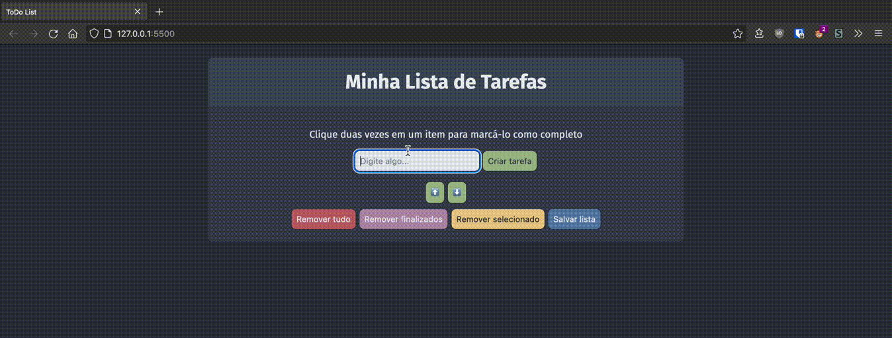
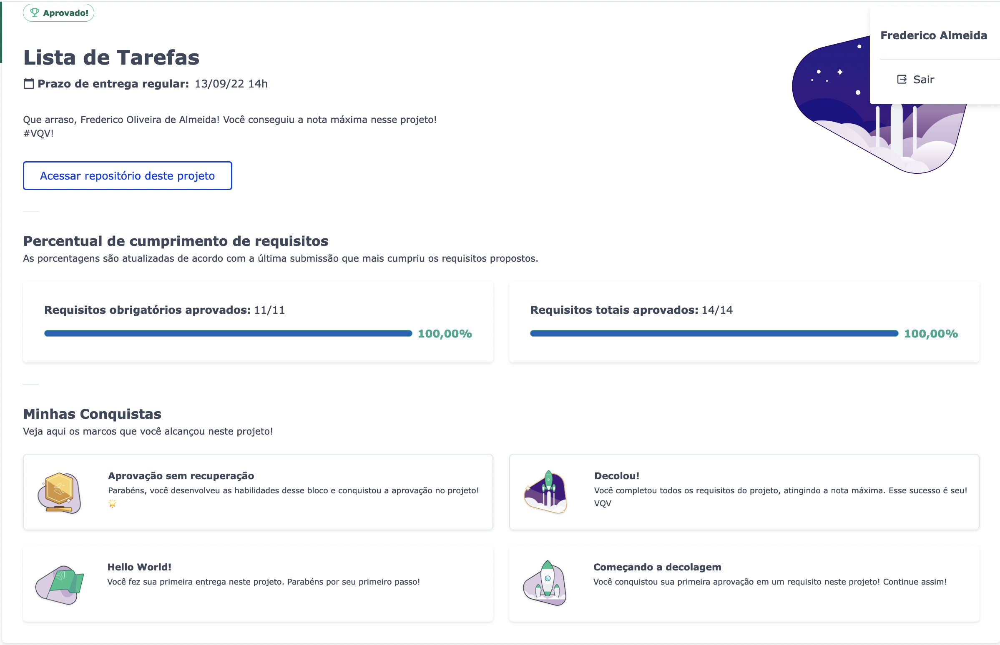

# Demo
### https://vrkknn.net/projects/todo-list/index.html

---

# Requisitos Obrigatórios

:warning: **Leia atentamente os requisitos e siga à risca o que for pedido**. Em particular, atente-se para **os nomes de _ids_ que alguns elementos de seu projeto devem possuir**.

## 1 - Adicione à sua lista o título "Minha Lista de Tarefas" em uma tag `<header>`

<strong>Adicione uma tag <code>header</code> com o conteúdo "Minha Lista de Tarefas"</strong>
 

**O que será testado:**

- A página deve possuir uma tag `header` com o conteúdo "Minha Lista de Tarefas".

## 2 - Adicione abaixo do título um parágrafo com o texto "Clique duas vezes em um item para marcá-lo como completo"

<strong>Adicione abaixo do título "Minha Lista de Tarefas" um parágrafo com id="funcionamento" e com o conteúdo do texto "Clique duas vezes em um item para marcá-lo como completo"</strong>
 

**O que será testado:**

- A página deve possuir  um elemento parágrafo com o ID `funcionamento`;
- O conteúdo do parágrafo deve ser `Clique duas vezes em um item para marcá-lo como completo`.

## 3 - Adicione um input onde a pessoa usuária poderá digitar o nome do item que deseja adicionar à lista

<strong>Adicione um input com o id="texto-tarefa" onde a pessoa usuária poderá digitar o nome do item que deseja adicionar à lista</strong>
 

**O que será testado:**

- A página deve possuir um elemento do tipo `input`;
- O elemento `input` deve possuir o ID `texto-tarefa`.

## 4 - Adicione uma lista ordenada de tarefas

<strong>Adicione uma lista ordenada de tarefas com o id="lista-tarefas"</strong>
 

**O que será testado:**

- A página deve possuir um elemento do tipo `ol`;
- O elemento `ol` deve possuir o ID `lista-tarefas`.

## 5 - Adicione um botão e, ao clicar nesse botão, um novo item deverá ser criado ao final da lista e o texto do input deve ser limpo

<strong>Adicione um botão com id="criar-tarefa" e, ao clicar nesse botão, um novo item deverá ser criado ao final da lista e o texto do input deve ser limpo</strong>
 

**O que será testado:**

- A página deve possuir um elemento do tipo `button`;
- O elemento `button` deve possuir o ID `criar-tarefa`;
- Ao digitar o texto `minha primeira tarefa` e clicar no botão `criar-tarefa`, o texto digitado deve aparecer na lista e **desaparecer do campo de input**;
- A adição de elementos na lista será feita algumas vezes, portanto todos os itens criados devem permanecer na lista na medida em que novos itens são adicionados. 

## 6 - Adicione três novas tarefas e ordene todas as tarefas da lista por ordem de criação

<strong>Adicione três tarefas à lista de tarefas e garanta que as tarefas adicionadas à lista não apareçam em uma ordem diferente da que foram criadas. Por exemplo, ao adicionar as tarefas `Fazer exercícios do bloco 4`, `Segunda tarefa` e `Anotar dicas de JS`, elas devem constar na lista exatamente nessa ordem.</strong>
 

**O que será testado:**

- A página deve possuir três tarefas e será checado se elas estão ordenadas por ordem de criação - ou seja, a primeira tarefa criada deve estar na primeira posição, depois a segunda, e assim por diante.

## 7 - Clicar em um item da lista deve alterar a cor de fundo do item para cinza

<strong>Ao clicar em um item da lista, este deve adquirir a cor adicionada à folha de estilo com o padrão: `background-color: nome-da-cor`, não sendo permitido qualquer outro padrão de nomenclatura de cores.</strong>
 

**O que será testado:**

- A página ao ser carregada deve possuir os itens da lista **sem** o estilo CSS `background-color: gray`;

- Os itens da lista ao serem clicados devem passar a ter o estilo CSS `background-color: gray`.

## 8 - Não deve ser possível selecionar mais de um elemento da lista ao mesmo tempo

<strong>Não deve ser possível selecionar mais de um elemento da lista ao mesmo tempo</strong>
 

**O que será testado:**

- Quando um elemento da lista é selecionado, o outro elemento anteriormente selecionado deve então ser desselecionado. Isso será verificado através da presença ou não do estilo `background-color: gray` no elemento.

## 9 - Clicar duas vezes em um item, faz com que ele seja riscado, indicando que foi completado. Deve ser possível desfazer essa ação clicando novamente duas vezes no item

<strong>Crie uma classe CSS com o nome "completed" e defina a propriedade "text-decoration" com o valor "line-through". Utilize a classe CSS "completed" para adicionar o efeito de letra tachada (riscada) às tarefas finalizadas.</strong>
 

**O que será testado:**

- Antes da ação ser disparada, o elemento adicionado à lista não deve possuir a classe `completed` nem o estilo `text-decoration: line-through solid black`;

- O item da lista ao receber duplo clique deve passar a ter a classe `completed` e o estilo `text-decoration` com o valor `line-through solid black`;

- O item da lista ao receber um segundo duplo clique, não deve mais possuir a classe `completed` nem o estilo `text-decoration: line-through solid black`.

## 10 - Adicione um botão que quando clicado deve apagar todos os itens da lista

<strong>Adicione um botão com id="apaga-tudo" que quando clicado deve apagar todos os itens da lista</strong>
 

**O que será testado:**

- A página deve possuir um elemento `button` com o ID `apaga-tudo`;

- Dado que uma lista possua tarefas, ao dar um clique no botão a lista deve ficar vazia.

## 11 - Adicione um botão que quando clicado remove **somente** os elementos finalizados da sua lista

<strong>Adicione um botão com id="remover-finalizados" que quando clicado remove **somente** os elementos finalizados da sua lista</strong>
 

**O que será testado:**

- A página deve possuir um elemento `button` com o ID `remover-finalizados`;

- Dado que uma lista possua tarefas finalizadas, ao clicar no botão, todos os elementos marcados como feitos devem ser removidos da lista.

---

# Requisitos Bônus

## 12 - Adicione um botão que salva o conteúdo da lista. Se você fechar e reabrir a página, a lista deve continuar no estado em que estava

<strong>Adicione um botão com id="salvar-tarefas" que salva o conteúdo da lista. Se você fechar e reabrir a página, a lista deve continuar no estado em que estava</strong>
 

**O que será testado:**

- A página deve possuir um elemento `button` com o ID `salvar-tarefas`;

- Dado que uma lista tenha várias tarefas, algumas das quais marcadas como finalizadas, um recarregamento da página deve manter a lista exatamente como está.

## 13 - Adicione dois botões, que permitam mover o item selecionado para cima ou para baixo na lista de tarefas

<strong>Adicione dois botões, um com id="mover-cima" e outro com id="mover-baixo", que permitam mover o item selecionado para cima ou para baixo na lista de tarefas</strong>
 

:warning: Pontos importantes sobre este requisito bônus: :warning:

- Antes de começar a desenvolver essa funcionalidade, pare e pense:  

O que significa mover um item de uma lista para cima ou para baixo no **_DOM_**? :thinking:  

:bulb: Você já possui todas as habilidades necessárias para fazer isso :smiley:.

- Habitue-se a pensar nos casos especiais ao construir programas. O que acontece se o usuário tentar mover o primeiro item para cima ou o último para baixo?

**O que será testado:**

- A página deve possuir dois elementos `button`, um com o ID `mover-cima` e o outro com o ID `mover-baixo`;

- Dado que diversos elementos foram acrescentados à lista, movimentá-los de formas diversas deve deixá-los permanecer nas posições esperadas;

- Caso algum elemento esteja finalizado, este status deve persistir ainda que se mova o elemento;

- Caso nenhum elemento esteja selecionado, ao clicar nos botões a lista não deve ser alterada;

- Um elemento que esteja selecionado deve se manter selecionado mesmo depois de movido;

- _Caso especial!_ Será verificado que, caso se tente subir o elemento no topo da lista ou, caso se tente descer o último elemento da lista, esta não deve ser alterada.

## 14 - Adicione um botão que, quando clicado, remove o item selecionado

<strong>Adicione um botão com id="remover-selecionado" que, quando clicado, remove o item selecionado</strong>
 

**O que será testado:**

- A página deve possuir um elemento `button` com um ID `remover-selecionado`;

- Ao clicar no botão, somente o elemento selecionado deve ser removido.

