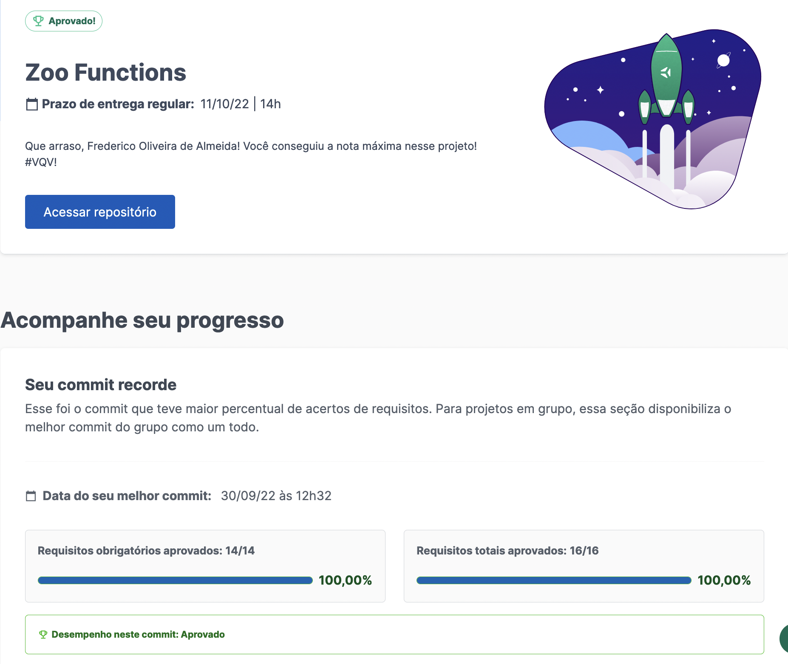

# Demo


---

# Requisitos Obrigatórios

⚠️ **PULL REQUESTS COM ISSUES NO LINTER NÃO SERÃO AVALIADAS. ATENTE-SE PARA RESOLVÊ-LAS ANTES DE FINALIZAR O DESENVOLVIMENTO!** ⚠️

## 1. Implemente a função `getSpeciesByIds`.

<details>
  <summary>
  Implemente a função <code>getSpeciesByIds</code> para buscar as espécies dos animais por meio de um <code>ID</code> e retorne um array contendo todos os animais dessa espécie. 
  </summary> <br />

- Faça com que a função `getSpeciesByIds` possa receber vários parâmetros;

- Retorne um array vazio se a função não receber um `id`;

- Retorne as seguintes informações do arquivo `data`:

  - Se a função receber apenas um `id`, retorne a espécie do animal referente a este `id`;

  - Se a função receber vários `ids`, retorne todas as espécies referente a esses `ids`.

**O que será testado:**

- A função `getSpeciesByIds`, caso não receba nenhum parâmetro, deve retornar um array vazio;

- A função `getSpeciesByIds`, caso receba como parâmetro um único `ID`, deve retornar um array com a espécie referente a esse `ID`;

- A função `getSpeciesByIds`, caso receba mais de um `ID`, deve retornar um array com as espécies referentes aos `IDs`.

</details>

---

## 2. Implemente a função `getAnimalsOlderThan`.

<details>
  <summary>
  Implemente a função <code>getAnimalsOlderThan</code> que deve receber uma espécie e uma idade como parâmetro, e então retornar se todos os animais dessa espécie possuem essa idade ou são mais velhos.
  </summary> <br />

- Verifique se todos os animais da espécie passada como parâmetro possuem a idade mínima:
  - Os animais devem ter essa idade ou serem mais velhos.

- Retorne um valor booleano.

**O que será testado:**

- A função, ao receber uma espécie e uma idade como parâmetros, deve testar se todos os animais desta espécie possuem a idade mínima especificada.

</details>

---

## 3. Implemente a função `getEmployeeByName`.

<details>
  <summary>
    Implemente a função <code>getEmployeeByName</code> que deve buscar por pessoas colaboradoras através de seu primeiro ou último nome.
  </summary> <br />

- Retorne um objeto vazio caso a função não receba parâmetros;

- Retorne as informações da pessoa colaboradora caso o parâmetro seja igual ao nome **ou** igual ao último nome no seguinte formato:

```javascript
  {
    id: 'c5b83cb3-a451-49e2-ac45-ff3f54fbe7e1',
    firstName: 'Nigel',
    lastName: 'Nelson',
    managers: ['0e7b460e-acf4-4e17-bcb3-ee472265db83', 'fdb2543b-5662-46a7-badc-93d960fdc0a8'],
    responsibleFor: ['0938aa23-f153-4937-9f88-4858b24d6bce', 'e8481c1d-42ea-4610-8e11-1752cfc05a46'],
  }
```

**O que será testado:**

- A função deve retornar um objeto vazio caso não receba parâmetros;

- A função deve retornar o objeto da pessoa colaboradora caso receba o seu primeiro nome como parâmetro; 

- A função deve retornar o objeto da pessoa colaboradora caso receba o seu último nome como parâmetro.
	

</details>

---

## 4. Implemente a função `getRelatedEmployees`.

<details>
  <summary>
    Implemente a função <code>getRelatedEmployees</code> para verificar se uma pessoa colaboradora é gerente e quais pessoas ela lidera.
  </summary> <br />

- Considerando a boa prática de dividir o código em partes menores, o arquivo terá duas funções:

1. A função `isManager` será responsável por verificar se uma pessoa colaboradora é gerente:
    - Deve retornar `true` se o `id` passado for de uma pessoa gerente;
    - Deve retornar `false` se o `id` passado não for de uma pessoa gerente.

2. A função `getRelatedEmployees` será responsável por retornar as pessoas lideradas pela gerência:
      - Utilize a função `isManager` para verificar se a pessoa é gerente ou não e fazer as seguintes verificações:

        - Caso a pessoa seja gerente, retorne um array contendo nome e sobrenome das pessoas colaboradoras gerenciadas por essa pessoa.

        Exemplo de output:

        ```javascript

        [ 'Burl Bethea', 'Ola Orloff', 'Emery Elser' ];

        ```

        - Caso a pessoa não seja gerente, dispare um erro com a mensagem: **'O id inserido não é de uma pessoa colaboradora gerente!'**.
  
        Para lançar o erro, você vai utilizar a função construtora **Error** da biblioteca padrão do JavaScript.

        Exemplo:

        ```javascript

        throw  new  Error('O id inserido não é de uma pessoa colaboradora gerente!');

        ```

        Você pode ler mais sobre a [função construtora **Error**, neste link.](https://developer.mozilla.org/pt-BR/docs/Web/JavaScript/Reference/Global_Objects/Error)

  **O que será testado:**

  - A função `isManager` deve retornar `true` se o `ID` passado for de uma pessoa gerente;

  - A função `isManager` deve retornar `false` se o `ID` passado não for de uma pessoa gerente;

  - A função `getRelatedEmployees`, caso o `ID` passado for da pessoa gerente, deve retornar um array contendo nome e sobrenome das pessoas colaboradoras pelas quais ela é responsável;

  - A função `getRelatedEmployees`, caso o `ID` passado **não** for da pessoa gerente, deve disparar um erro com a mensagem: `'O id inserido não é de uma pessoa colaboradora gerente!'`.

</details>

---

## 5. Implemente a função `countAnimals`.

<details>
  <summary>
    Implemente a função <code>countAnimals</code> que deverá contabilizar a quantidade de espécies de animais residentes no zoológico.
  </summary> <br />

- A função `countAnimals` é responsável por contar a quantidade de animais que residem no zoológico.
  
- Retorne a quantidade de animais residentes por espécie caso não seja passado nenhum parâmetro. O retorno deverá ser um objeto cujo o nome de cada espécie é a chave e o total de animais (residentes) dessa espécie é o valor. Por exemplo:

```javascript
  {
    lions: 4,
    // [...]
  }
```

- Retorne a quantidade de animais residentes no zoológico da espécie passada por parâmetro. Por exemplo:

  - ao receber o argumento `{ specie: 'penguins' }`, retorna apenas a quantidade (número) de pinguins que residem no zoológico;

  - ao passar o argumento `{ specie: 'giraffes', sex: 'female' }`, retorna apenas a quantidade (número) de girafas fêmeas que residem no zoológico.

**O que será testado:**

- A função `countAnimals`, caso não receba nenhum parâmetro, deve retornar todas as espécies e a quantidade de residentes de cada uma;

- A função `countAnimals`, caso receba como parâmetro um objeto com a chave `specie`, deve retornar a quantidade de animais daquela espécie;

- A função `countAnimals`, caso receba como parâmetro um objeto com as chaves `specie` e `sex`, deve retornar a quantidade de animais daquela espécie, no sexo selecionado.

</details>

---

## 6. Obtenha ao menos 80% de cobertura de testes na função `handlerElephants`.

<details>
  <summary>
    Implemente os testes da função <code>handlerElephants</code> para obter ao menos 80% de cobertura
  </summary> <br />

Essa função retorna informações referentes aos elefantes conforme o argumento passado:

| Argumento | Informação |
| --------- | ---------- |
| `count` | retorna a quantidade de elefantes |
| `names` | retorna um array com a relação dos nomes de todos os elefantes |
| `averageAge` | retorna a média de idade dos elefantes |
| `location` | retorna a localização dos elefantes dentro do Zoológico |
| `popularity` | retorna a popularidade dos elefantes |
| `availability` | retorna um array com a relação de dias em que é possível visitar os elefantes |

> **De olho na dica 👀:** Antes de começar a escrever os testes, leia a função `handlerElephants` e procure entendê-la linha a linha

- Implemente os testes nos arquivos da pasta `test` que está na raiz do projeto;

- A função `handlerElephants` já está implementada, sendo necessário apenas criar os testes;

- A função é case sensitive;

- Use o comando `npm test handlerElephants` para verificar se seus testes estão passando;

- Use o comando `npm run test:coverage` para testar a cobertura.

**A cobertura irá checar apenas as funções destacadas e não toda a aplicação!**

⚠️ **Atenção:** não altere a estrutura já implementada nos arquivos de testes, apenas adicione os testes dentro do bloco `describe`.

<details>
  <summary>
    💡 <strong> Dicas do que você pode testar:</strong>
  </summary> <br />

⚠️ **Atenção:** Os tópicos abaixo são apenas sugestões, sinta-se livre para testar o que achar necessário desde que a cobertura da função atinja ao menos 80%

- Para o argumento `count` deve retornar o número inteiro `4`;

- Para o argumento `names` deve retornar um array de nomes que possui o nome `Jefferson`;

- Para o argumento `averageAge` deve retornar um número próximo a `10.5`;

</details>

</details>

---

## 7. Obtenha ao menos 90% de cobertura de testes na função `handlerElephants`.

<details>
  <summary>
    Implemente os testes da função <code>handlerElephants</code> para obter ao menos 90% de cobertura
  </summary> <br />

Essa função retorna informações referentes aos elefantes conforme o argumento passado:

| Argumento | Informação |
| --------- | ---------- |
| `count` | retorna a quantidade de elefantes |
| `names` | retorna um array com a relação dos nomes de todos os elefantes |
| `averageAge` | retorna a média de idade dos elefantes |
| `location` | retorna a localização dos elefantes dentro do Zoológico |
| `popularity` | retorna a popularidade dos elefantes |
| `availability` | retorna um array com a relação de dias em que é possível visitar os elefantes |

- A função é case sensitive;

- Use o comando `npm test handlerElephants` para verificar se seus testes estão passando;

- Use o comando `npm run test:coverage` para testar a cobertura.

⚠️ **Atenção:** não altere a estrutura já implementada nos arquivos de testes, apenas adicione os testes dentro do bloco `describe`.

<details>
  <summary>
    💡 <strong> Dicas do que você pode testar:</strong>
  </summary> <br />

⚠️ **Atenção:** Os tópicos abaixo são apenas sugestões, sinta-se livre para testar o que achar necessário desde que a cobertura da função atinja ao menos 90%.

- Para o argumento `count` deve retornar o número inteiro `4`;

- Para o argumento `names` deve retornar um array de nomes que possui o nome `Jefferson`;

- Para o argumento `averageAge` deve retornar um número próximo a `10.5`;

- Para o argumento `location` deve retornar a string `NW`;

- Para o argumento `popularity` deve retornar um número igual ou maior a 5;

- Para o argumento `availability` deve retornar um array de dias da semana que não contém `Monday`;

- Não passando argumentos a função deve retornar `undefined`;

</details>

</details>

---

## 8. Implemente a função `calculateEntry`.

<details>
  <summary>
    Calcule o valor <strong>total</strong> da entrada dos visitantes do zoológico. 
  </summary> <br />

O valor das entradas do zoológico é calculado a partir da faixa etária, onde:

  - `child`: são pessoas **menores** de 18 anos;

  - `adult`: são pessoas com idade **maior ou igual** a 18 anos **e menor** que 50 anos;

  - `senior`: são pessoas com idade **maior ou igual** a 50 anos.

Considerando a boa prática de dividir o código em partes menores, o arquivo terá duas funções, chamadas de `countEntrants` e `calculateEntry`. 

As duas funções recebem um array no seguinte formato:

```javascript
const entrants = [
	{ name:  'Lara Carvalho', age:  5 },
	{ name:  'Frederico Moreira', age:  5 },
	{ name:  'Pedro Henrique Carvalho', age:  5 },
	{ name:  'Maria Costa', age:  18 },
	{ name:  'Núbia Souza', age:  18 },
	{ name:  'Carlos Nogueira', age:  50 },
];
```

1. A função `countEntrants` será responsável por calcular a quantidade de visitantes por faixa etária: 

  Ela recebe um array e deve retornar um **objeto**. Para isso:

  - Realize a soma da quantidade de visitantes por faixa etária;

  - Retorne um objeto em um formato como esse: `{ child: 3, adult: 2, senior: 1 }`.

2. A função `calculateEntry` será responsável por somar o valor da entrada das pessoas no zoológico:

  Ela recebe um array e deve retornar a soma **total** dos valores do ingresso. Para isso:

  - Retorne `0` se nenhum parâmetro for passado ou seja um array vazio;

  - Utilize a função `countEntrants` para ter a quantidade total de pessoas por faixa etária;

  - Realize a soma dos valores dos ingressos por faixa etária. Seu retorno deve ser parecido com esse: `187.94`.

> **De olho na dica 👀:** O valor a ser cobrado pela faixa de idades também consta no arquivo de dados.

**Exemplo de uso da função `calculateEntry`:**

```javascript
calculateEntry(entrants);
```

**Saída:**

```javascript
187.94
```

**O que será testado:**

- A função `countEntrants`:

  - Ao receber um array de visitantes, retorna um objeto com a contagem.

- A função `calculateEntry`:

  - Retorna 0 se nenhum argumento for passado;

  - Retorna 0 se um objeto vazio for passado;

  - Ao receber um array de pessoas com 3 crianças, 2 pessoas adultas e 1 pessoa mais velha retorna o valor correto;

  - Ao receber um array com 1 pessoa adulta retorna o valor correto;

  - Ao receber um array com 1 pessoa mais velha retorna o valor correto;

  - Ao receber um array com 1 criança retorna o valor correto;

  - Ao receber um array com 1 criança e 1 pessoa mais velha retorna o valor correto.

</details>

---

## 9. Implemente a função `getSchedule`.

<details>
  <summary>
   Implemente a função <code>getSchedule</code> que irá disponibilizar um cronograma com os horários de visita da semana disponíveis para cada espécie de animal.
  </summary> <br />

  As informações dos horários dos animais devem ser disponibilizadas em uma consulta para as pessoas que estão visitando o zoológico, que podem querer ter acesso ao cronograma da semana, de um dia ou de um animal específico.

  - Retorne um array com os dias da semana em que um animal está disponível para visitação caso o parâmetro da função seja um animal. Por exemplo: `[ 'Tuesday', 'Thursday', 'Saturday', 'Sunday' ]`;

   Retorne todos os horários disponíveis para cada dia da semana caso a função:

    - não receba parâmetro;

    - o parâmetro passado para a função não seja um animal ou um dia;

  Para isso:

  - Crie um objeto e adicione todos os dias da semana como chave;

  - Os valores de cada dia da semana deve ser um objeto, possuindo as chaves `officeHour` e `exhibition`:

    - `officeHour` deve possuir o texto com o horário que o zoológico abre e fecha naquele dia da semana;

    - `exhibition` deve possuir um array com o nome de todos os animais disponíveis para visitação naquele dia da semana.

<details>
  <summary>
    O retorno deve ser parecido com esse:
  </summary> <br />

  ```javascript
  {
    Tuesday: { // Dia da semana
      officeHour: 'Open from 8am until 6pm', // n
      exhibition: [ 'lions', 'tigers', 'bears', 'penguins', 'elephants', 'giraffes' ],
    },
    Wednesday: {
      officeHour: 'Open from 8am until 6pm',
      exhibition: [ 'tigers', 'bears', 'penguins', 'otters', 'frogs', 'giraffes' ],
    },
    // [...]
  }
  ```

</details>

> **De olho na dica 👀:** Quebre o problema em funções menores para que fique mais simples de administrar a responsabilidade de cada uma delas.

**O que será testado:**

- A função, caso receba o nome de um animal por parâmetro, deverá retornar um array com os dias em que ele estará em exibição;

- A função caso não receba parâmetros, deverá retornar os horários para cada dia e quais animais estarão disponíveis;

- A função, caso receba parâmetros que não sejam nem um animal e nem um dia, retorna os horários para cada dia e quais animais estarão disponíveis;

- A função, caso receba um único dia por parâmetro, deverá retornar os horários para aquele dia e quais animais estarão disponíveis.


</details>

---

## 10. Implemente a função `getOldestFromFirstSpecies`.

<details>
  <summary>
    Implemente a função <code>getOldestFromFirstSpecies</code> que deverá encontrar o animal mais velho da espécie gerenciado por uma pessoa colaboradora.
  </summary> <br />

- A função recebe um parâmetro `ID` referente à pessoa colaboradora e a partir desse `ID`:

  - A função deverá encontrar a pessoa colaboradora que possui o `ID` passado por parâmetro;

  - A função deverá encontrar a **primeira** espécie de animal que a pessoa colaboradora é responsável;

  - A função deverá encontrar o animal mais velho daquela espécie;

  - A função deverá retornar um array com as informações do animal mais velho daquela espécie.

**O que será testado:**

- Passado o id de uma pessoa colaboradora, a função `getOldestFromFirstSpecies` deverá encontrar a primeira espécie de animal gerenciado por essa pessoa, e retornar um array com nome, sexo e idade do animal mais velho dessa espécie.

</details>

---

## 11. Implemente a função `getEmployeesCoverage`.

<details>
  <summary>
    Implemente a função <code>getEmployeesCoverage</code> que deverá retornar as informações sobre a pessoa colaboradora e por quais espécies ela é responsável.
  </summary> <br />

- A função vai receber um objeto como parâmetro que vai determinar o seu comportamento, sendo:

  - `name`: o nome **ou** sobrenome da pessoa a ser buscada;

  -  `id`: o id da pessoa a ser buscada.

- A função deve retornar um objeto no seguinte formato:

```javascript
{
	id: "4b40a139-d4dc-4f09-822d-ec25e819a5ad", // id da pessoa
	fullName: "Sharonda Spry", // nome completo: firstName + lastName
	species: [ "otters", "frogs" ], // espécies as quais a pessoa é responsável
	locations: [ "SE", "SW" ], // Um array contendo todas as localizações das espécies
}
```

Para isso:

  - Retorne as informações da pessoa correspondente ao receber um objeto com a propriedade `name`:
    - a propriedade `name` pode possuir como valor o primeiro ou último nome da pessoa colaboradora, portanto garanta que seu código funciona das duas maneiras. 

  - Retorne as informações da pessoa correspondente ao receber um objeto com a propriedade `id`;

  - Retorne um array com as informações de **todas** as pessoas colaboradoras caso a função não receba parâmetro;

  - Lance um erro caso o `id` seja inválido.


**Exemplos de uso da função `getEmployeesCoverage`:**

  <details>
    <summary>
      Caso o parâmetro seja um objeto com nome e id, retorne as informações da pessoa colaboradora 
    </summary> <br />

**ENTRADA:**

```javascript
getEmployeesCoverage({ name:  'Sharonda' }); // name recebe o primeiro nome como parâmetro ou
getEmployeesCoverage({ name:  'Spry' }); // name recebe o último nome como parâmetro ou
getEmployeesCoverage({ id:  '4b40a139-d4dc-4f09-822d-ec25e819a5ad' }); // recebe um id como parâmetro
```

**SAÍDA:**

```json
{
	"id": "4b40a139-d4dc-4f09-822d-ec25e819a5ad",
	"fullName": "Sharonda Spry",
	"species": [ "otters", "frogs" ],
	"locations": [ "SE", "SW" ]
}
```

</details>

  <details>
    <summary>
      Caso a função não receba parâmetros, retorne um array com a informação de <strong>todas</strong> as pessoas colaboradoras
    </summary> <br />

**ENTRADA:**

```javascript
getEmployeesCoverage();
```

**SAÍDA:**

```javascript
[
	{
		"id":  "c5b83cb3-a451-49e2-ac45-ff3f54fbe7e1",
		"fullName":  "Nigel Nelson",
		"species": [ "lions", "tigers" ],
		"locations": [ "NE", "NW" ],
	},
	{
		"id":  "0e7b460e-acf4-4e17-bcb3-ee472265db83",
		"fullName":  "Burl Bethea",
		"species": [ "lions", "tigers", "bears", "penguins" ],
		"locations": [ "NE", "NW", "NW", "SE" ],
	},
	{
		"id":  "fdb2543b-5662-46a7-badc-93d960fdc0a8",
		"fullName":  "Ola Orloff",
		"species": [ "otters", "frogs", "snakes", "elephants" ],
		"locations": [ "SE", "SW", "SW", "NW" ],
	},
	//[...]
];
```

</details>

<details>
  <summary>
    Caso nenhuma pessoa seja encontrada com o nome, sobrenome ou id, lance um erro
  </summary> <br />

Caso nenhuma pessoa seja encontrada com o nome, sobrenome ou id, deverá ser lançado um erro gerado com a função construtora **Error** da biblioteca padrão do JavaScript com a mensagem **"Informações inválidas"**. Exemplo:

```javascript
throw new Error('Informações inválidas');
```

Você pode ler mais sobre a [função construtora **Error**, neste link.](https://developer.mozilla.org/pt-BR/docs/Web/JavaScript/Reference/Global_Objects/Error)

</details> 

<br />

> **De olho na dica 👀:** Crie funções que dividam as tarefas em partes menores. Por exemplo, você pode criar uma função `getSpecies` encarregada somente por buscar o nome das espécies que a pessoa é responsável.

**O que será testado:**

- A função, caso o objeto passado por parâmetro tenha a propriedade `name`, deverá retornar somente a pessoa correspondente;

- A função poderá receber como parâmetro um objeto com a propriedade `name` recebendo o segundo nome como valor;

- A função, caso o objeto passado por parâmetro tenha a propriedade `id`, deverá retornar somente a pessoa correspondente;

- A função, caso não receba parâmetros, deverá retornar uma lista com a cobertura de todas as pessoas colaboradoras;

- A função, caso não haja nenhuma pessoa com o `name` ou `id` especificados deverá lançar um `error`.

</details>

---

## 12. Obtenha ao menos 85% de cobertura de testes na função `getOpeningHours`.

<details>
  <summary>
    Implemente os testes da função <code>getOpeningHours</code> para obter ao menos 85% de cobertura
  </summary> <br />

Esta função recebe como argumentos um dia da semana e um horário, e retorna uma mensagem informando se o zoológico está aberto ou não naquela data e hora.

> **De olho na dica 👀:** Antes de começar a escrever os testes, leia a função `getOpeningHours` e procure entendê-la linha a linha.

- Implemente os testes nos arquivos da pasta `test` que está na raiz do projeto;

- A função `getOpeningHours` já está implementada, sendo necessário apenas criar os testes;

- Use o comando `npm test getOpeningHours` para verificar se seus testes estão passando;

- Use o comando `npm run test:coverage` para testar a cobertura;

- O nome do dia da semana passado como argumento tem que ser em inglês;

- O horário precisa ter a seguinte formatação `'XX:XX-XM'`;

- As horas serão validadas na nomenclatura `'AM'` e `'PM'`;

- A função não faz diferenciação entre maiúsculas e minúsculas;

**A cobertura irá checar apenas as funções destacadas e não toda a aplicação!**

⚠️ **Atenção:** não altere a estrutura já implementada nos arquivos de testes, apenas adicione os testes dentro do bloco `describe`.

<details>
  <summary>
    💡 <strong> Dicas do que você pode testar:</strong>
  </summary> <br />

⚠️ **Atenção:** Os tópicos abaixo são apenas sugestões, sinta-se livre para testar o que achar necessário desde que a cobertura da função atinja ao menos 85%.

- Teste não passando argumentos. Deverá retornar o objeto:

```javascript
{
	Tuesday: { open: 8, close: 6 },
	Wednesday: { open: 8, close: 6 },
	Thursday: { open: 10, close: 8 },
	Friday: { open: 10, close: 8 },
	Saturday: { open: 8, close: 10 },
	Sunday: { open: 8, close: 8 },
	Monday: { open: 0, close: 0 },
}
```

- Para os argumentos `Monday` e `09:00-AM` deve retornar a string `'The zoo is closed'` (Já que o Zoo está sempre fechado na segunda);

- Para os argumentos `Tuesday` e `09:00-AM` deve retornar a string `'The zoo is open'`;

- Para os argumentos `Wednesday` e `09:00-PM` deve retornar a string `'The zoo is closed'`;

</details>

</details>

---

## 13. Obtenha ao menos 95% de cobertura de testes na função `getOpeningHours`.

<details>
  <summary>
    Implemente os testes da função <code>getOpeningHours</code> para obter 95% de cobertura
  </summary> <br />

  Esta função recebe como argumentos um dia da semana e um horário, e retorna uma mensagem informando se o zoológico está aberto ou não naquela data e hora.

- Use o comando `npm test getOpeningHours` para verificar se seus testes estão passando;

- Use o comando `npm run test:coverage` para testar a cobertura;

- O nome do dia da semana passado como argumento tem que ser em inglês;

- O horário precisa ter a seguinte formatação `'XX:XX-XM'`;

- As horas serão validadas na nomenclatura `'AM'` e `'PM'`;

- A função não faz diferenciação entre maiúsculas e minúsculas.

⚠️ **Atenção:** não altere a estrutura já implementada nos arquivos de testes, apenas adicione os testes dentro do bloco `describe`.

<details>
  <summary>
    💡 <strong> Dicas do que você pode testar:</strong>
  </summary> <br />

⚠️ **Atenção:** Os tópicos abaixo são apenas sugestões, sinta-se livre para testar o que achar necessário desde que a cobertura da função atinja ao menos 95%.

- Teste não passando argumentos. Deverá retornar o objeto:

```javascript
{
	Tuesday: { open: 8, close: 6 },
	Wednesday: { open: 8, close: 6 },
	Thursday: { open: 10, close: 8 },
	Friday: { open: 10, close: 8 },
	Saturday: { open: 8, close: 10 },
	Sunday: { open: 8, close: 8 },
	Monday: { open: 0, close: 0 },
}
```

- Para os argumentos `Monday` e `09:00-AM` deve retornar a string `'The zoo is closed'` (Já que o Zoo está sempre fechado na segunda);

- Para os argumentos `Tuesday` e `09:00-AM` deve retornar a string `'The zoo is open'`;

- Para os argumentos `Wednesday` e `09:00-PM` deve retornar a string `'The zoo is closed'`;

- Para os argumentos `Thu` e `09:00-AM` deve lançar uma exceção com a mensagem: `'The day must be valid. Example: Monday'`

- Para os argumentos `Friday` e `09:00-ZM` deve lançar uma exceção com a mensagem: `'The abbreviation must be \'AM\' or \'PM\''`;

- Para os argumentos `Saturday` e `C9:00-AM` deve lançar uma exceção com a mensagem: `'The hour should represent a number'`;

- Para os argumentos `Sunday` e `09:c0-AM` deve lançar uma exceção com a mensagem: `'The minutes should represent a number'`;

</details>

</details>

---

## 14. Implemente a função `getAnimalMap`.

<details>
  <summary>
    Faça o mapeamento geográfico dos animais de cada espécie e realize filtros de localização, nome em ordem alfabética e sexo.
  </summary> <br />

- A função `getAnimalMap` é responsável por categorizar os animais por localização, além de filtrá-los por região, nome e sexo a partir de um parâmetro. A estrutura do retorno da função é baseada na localização das espécies:

```javascript
  {
    NE: [ /* dados aqui */],
    NW: [/* dados aqui */],
    SE: [/* dados aqui */],
    SW: [/* dados aqui */],
  }
```
  
   Os parâmetros da função podem ser:

   <details>
     <summary>
      <code>includeNames: true</code>, que retorna o nome dos animais no seguinte formato:
     </summary> <br />

```javascript
  NE: [
    { lions: ['Zena', 'Maxwell', 'Faustino', 'Dee'] },
    { giraffes: ['Gracia', 'Antone', 'Vicky', 'Clay', 'Arron', 'Bernard'] },
  ],
  // [...]
```
   </details>

<details>
  <summary>
    <code>sorted: true</code> que retorna o nome dos animais por ordem alfabética no seguinte formato:
  </summary> <br />

  ```javascript
  NE: [
    { lions: ['Dee', 'Faustino', 'Maxwell', 'Zena'] },
    { giraffes: ['Antone', 'Arron', 'Bernard', 'Clay', 'Gracia', 'Vicky'] },
  ],
  // [...]
```
</details>

<details>
  <summary>
    <code>sex: male</code> ou <code>sex: female</code> retorna o <strong>nome</strong> dos animais que são machos ou fêmeas no seguinte formato:
  </summary><br />

```javascript
  NE: [
    { lions: ['Zena', 'Dee'] },
    { giraffes: ['Gracia', 'Vicky'] },
  ],
  // [...]
```

⚠️ **Atenção:** Se o parâmetro for `{ sex: male }`, retorne apenas o nome dos animais machos e se o parâmetro for `{ sex: female }` retorne apenas o nome dos animais fêmeas.

</details>

<details>
  <summary>
  Caso a função não receba parâmetro, as espécies dos animais devem ser categorizadas por localização e deve retornar um objeto no seguinte formato:
  </summary> <br />

  ```javascript
  {
    NE: ['lions', 'giraffes'],
    NW: ['tigers', 'bears', 'elephants'],
    SE: ['penguins', 'otters'],
    SW: ['frogs', 'snakes'],
  }
  ```

</details>

Para isso:

  - Retorne a espécie de todos os animais categorizados por localização caso a função:

    - não receba parâmetro;

    - não receba o parâmetro `{includeNames: true}` e receba apenas o parâmetro `{sex: female}`;

    - não receba o parâmetro `{includeNames: true}` e receba apenas o parâmetro `{sex: female, sorted: true}`.

  - Retorne a espécie e o nome dos animais caso a função receba apenas o parâmetro `{includeNames: true}`;

  - Retorne a espécie e o nome dos animais em ordem alfabética caso a função receba o parâmetro `{includeNames: true, sorted: true}`;

  - Retorne a espécie e o nome dos animais filtrado por sexo:

    - Retorne a espécie e o nome dos animais fêmeas, caso o parâmetro da função seja `{includeNames: true, sex: female}`;

    - Retorne a espécie e o nome dos animais machos, caso o parâmetro da função seja `{includeNames: true, sex: male}`;

  - Retorne a espécie e o nome dos animais filtrado por sexo e por ordem alfabética:

    - Retorne a espécie e o nome dos animais fêmeas em ordem alfabética, caso o parâmetro da função seja `{includeNames: true, sex: female, sorted: true}`;

    - Retorne a espécie e o nome dos animais machos em ordem alfabética, caso o parâmetro da função seja `{includeNames: true, sex: male, sorted: true}`;
  
> **De olho na dica 👀:** Você não precisa diferenciar os filtros de sexo entre `female` ou `male`, apenas por `sex`.

**O que será testado:**

- A função, caso não receba parâmetros, deverá retornar animais categorizados por localização;

- A função, caso receba parâmetro sem a opção `includeNames` especificada, deverá retornar animais categorizados por localização;

- A função, caso receba parâmetro com a opção `includeNames: true` especificada, deverá retornar nomes de animais;

- A função, caso receba parâmetro com a opção `sorted: true` especificada, deverá retornar nomes de animais ordenados;

- A função, caso receba parâmetro com a opção `sex: 'female'` ou `sex: 'male'` especificada, deverá retornar somente nomes de animais macho/fêmea;

- A função, caso receba parâmetro com a opção `sex: 'female'` ou `sex: 'male'` especificada e a opção `sorted: true` especificada, deverá retornar somente nomes de animais macho/fêmea com os nomes dos animais ordenados;

</details>

---

# Requisitos Bônus

## 15. Obtenha 100% de cobertura de testes na função `handlerElephants`.

<details>
  <summary>
    Implemente os testes da função <code>handlerElephants</code> para obter 100% de cobertura
  </summary> <br />

Essa função retorna informações referentes aos elefantes conforme o argumento passado:

| Argumento | Informação |
| --------- | ---------- |
| `count` | retorna a quantidade de elefantes |
| `names` | retorna um array com a relação dos nomes de todos os elefantes |
| `averageAge` | retorna a média de idade dos elefantes |
| `location` | retorna a localização dos elefantes dentro do Zoológico |
| `popularity` | retorna a popularidade dos elefantes |
| `availability` | retorna um array com a relação de dias em que é possível visitar os elefantes |

- A função é case sensitive;

- Use o comando `npm test handlerElephants` para verificar se seus testes estão passando;

- Use o comando `npm run test:coverage` para testar a cobertura.

⚠️ **Atenção:** não altere a estrutura já implementada nos arquivos de testes, apenas adicione os testes dentro do bloco `describe`.

<details>
  <summary>
    💡 <strong> Dicas do que você pode testar:</strong>
  </summary> <br />

⚠️ **Atenção:** Os tópicos abaixo são apenas sugestões, sinta-se livre para testar o que achar necessário desde que a cobertura da função atinja 100%.

- Para o argumento `count` deve retornar o número inteiro `4`;

- Para o argumento `names` deve retornar um array de nomes que possui o nome `Jefferson`;

- Para o argumento `averageAge` deve retornar um número próximo a `10.5`;

- Para o argumento `location` deve retornar a string `NW`;

- Para o argumento `popularity` deve retornar um número igual ou maior a 5;

- Para o argumento `availability` deve retornar um array de dias da semana que não contém `Monday`;

- Não passando argumentos a função deve retornar `undefined`;

- Passando por argumento um objeto vazio (`{}`) deve retornar a string `'Parâmetro inválido, é necessário uma string'`;

- Passada uma string que não contempla uma funcionalidade deve retornar `null`.

</details>
</details>

---

## 16. Obtenha ao menos 100% de cobertura de testes na função `getOpeningHours`.

<details>
  <summary>
    Implemente os testes da função <code>getOpeningHours</code> para obter 100% de cobertura
  </summary> <br />

  Esta função recebe como argumentos um dia da semana e um horário, e retorna uma mensagem informando se o zoológico está aberto ou não naquela data e hora.

- Use o comando `npm test getOpeningHours` para verificar se seus testes estão passando;

- Use o comando `npm run test:coverage` para testar a cobertura;

- O nome do dia da semana passado como argumento tem que ser em inglês;

- O horário precisa ter a seguinte formatação `'XX:XX-XM'`;

- As horas serão validadas na nomenclatura `'AM'` e `'PM'`;

- A função não faz diferenciação entre maiúsculas e minúsculas.

⚠️ **Atenção:** não altere a estrutura já implementada nos arquivos de testes, apenas adicione os testes dentro do bloco `describe`.


  <details>
  <summary>
    💡 <strong> Dicas do que você pode testar:</strong>
  </summary> <br />

⚠️ **Atenção:** Os tópicos abaixo são apenas sugestões, sinta-se livre para testar o que achar necessário desde que a cobertura da função atinja ao menos 100%.

- Teste não passando argumentos. Deverá retornar o objeto:

```javascript
{
	Tuesday: { open: 8, close: 6 },
	Wednesday: { open: 8, close: 6 },
	Thursday: { open: 10, close: 8 },
	Friday: { open: 10, close: 8 },
	Saturday: { open: 8, close: 10 },
	Sunday: { open: 8, close: 8 },
	Monday: { open: 0, close: 0 },
}
```

- Para os argumentos `Monday` e `09:00-AM` deve retornar a string `'The zoo is closed'` (Já que o Zoo está sempre fechado na segunda);

- Para os argumentos `Tuesday` e `09:00-AM` deve retornar a string `'The zoo is open'`;

- Para os argumentos `Wednesday` e `09:00-PM` deve retornar a string `'The zoo is closed'`;

- Para os argumentos `Thu` e `09:00-AM` deve lançar uma exceção com a mensagem: `'The day must be valid. Example: Monday'`

- Para os argumentos `Friday` e `09:00-ZM` deve lançar uma exceção com a mensagem: `'The abbreviation must be \'AM\' or \'PM\''`;

- Para os argumentos `Saturday` e `C9:00-AM` deve lançar uma exceção com a mensagem: `'The hour should represent a number'`;

- Para os argumentos `Sunday` e `09:c0-AM` deve lançar uma exceção com a mensagem: `'The minutes should represent a number'`;

- Para os argumentos `Monday` e `13:00-AM` deve lançar uma exceção com a mensagem: `'The hour must be between 0 and 12'`;

- Para os argumentos `Tuesday` e `09:60-AM` deve lançar uma exceção com a mensagem: `'The minutes must be between 0 and 59'`.

</details>

</details>
