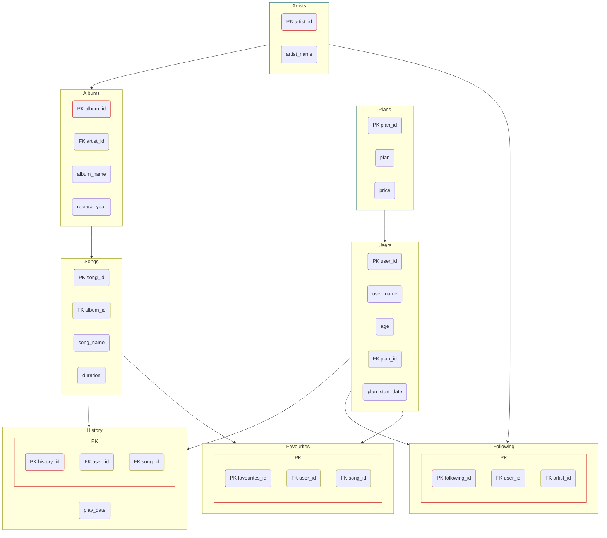

# One For All

```mermaid
graph TD;

classDef pk stroke:#cc241d
classDef fk stroke:#98971a
classDef unref stroke:#458588
style ide21 stroke:#cc241d
style ide71 stroke:#cc241d
style ide81 stroke:#cc241d

subgraph ide1 [Users]
	id11(PK user_id):::pk
	id12(user_name)
	id13(age)
	id14(FK plan_id):::fk
	id15(plan_start_date)
end

subgraph ide2 [History]
	subgraph ide21 [PK]
		id210(PK history_id):::pk
		id211(FK user_id):::fk
		id212(FK song_id):::fk
	end
	id21(play_date)
end

subgraph ide3 [Plans]
	id31(PK plan_id):::Pk
	id32(plan)
	id33(price)
end

subgraph ide4 [Albums]
	id41(PK album_id):::pk
	id42(FK artist_id):::fk
	id43(album_name)
	id44(release_year)
end

subgraph ide5 [Songs]
	id51(PK song_id):::pk
	id52(FK album_id):::fk
	id53(song_name)
	id54(duration)
end

subgraph ide6 [Artists]
	id61(PK artist_id):::pk
	id62(artist_name)
end

subgraph ide7 [Following]
	subgraph ide71 [PK]
		id710(PK following_id):::pk
		id711(FK user_id):::fk
		id712(FK artist_id):::fk
	end
end

subgraph ide8 [Favourites]
	subgraph ide81 [PK]
		id810(PK favourites_id):::pk
		id811(FK user_id):::fk
		id812(FK song_id):::fk
	end
end

ide3:::unref --> ide1 --> ide2 & ide7 & ide8
ide4 --> ide5 --> ide2 & ide8
ide6:::unref --> ide4 & ide7
```