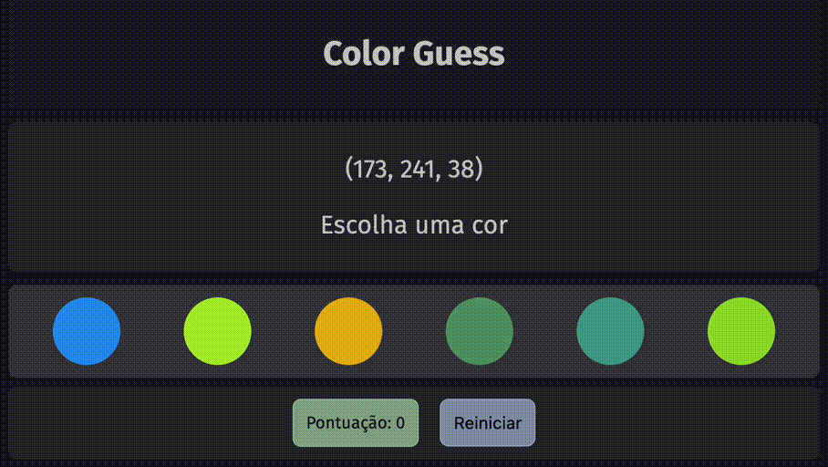
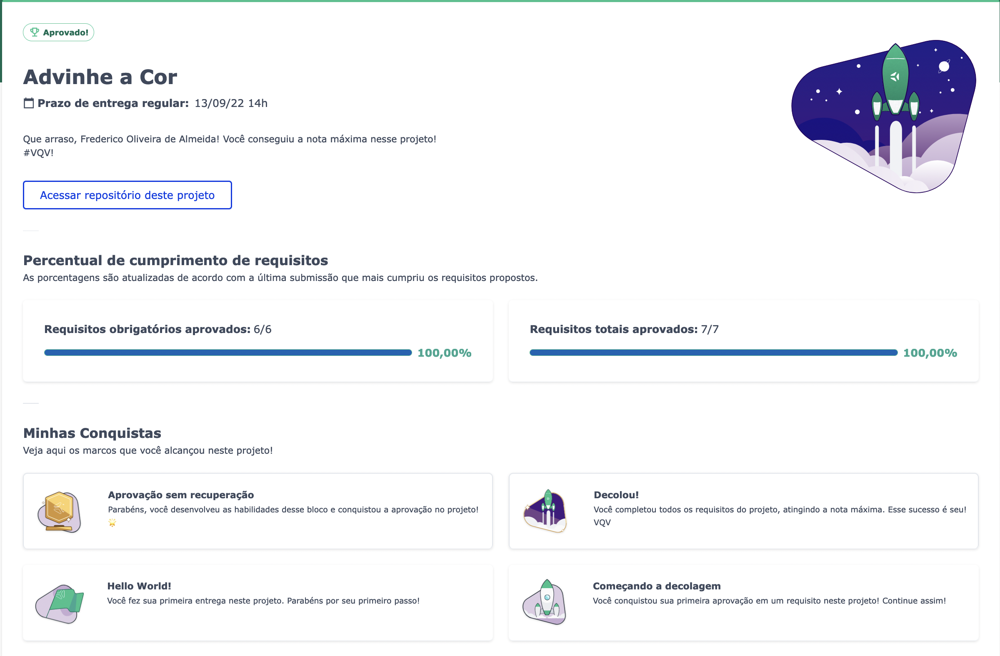

# Demo
## https://vrkknn.net/projects/color-guess/index.html

---

# Requisitos

>⚠️ Leia-os atentamente e siga à risca o que for pedido. Em particular, **atente-se para os nomes de _ids_ que alguns elementos de seu projeto devem possuir**. ⚠️

O não cumprimento de um requisito, total ou parcialmente, impactará em sua avaliação.

## 1 - Adicione no seu site um título com o nome do seu jogo

  
Adicione à sua página um título com o nome do seu jogo utilizando a tag `h1` com o id `title`
 

**O que será testado:**

- Sua página deve possuir uma tag `h1` com ID `title`.
  

## 2 - Adicione um texto com o código RGB a ser adivinhado

  
Sua página deverá conter uma tag `p` com o conteúdo da cor a ser adivinhada no formato rgb `(168, 34, 1)` e com o id `rgb-color`
 

**O que será testado:**

- Sua página deve possuir uma tag `p` com ID `rgb-color`;

- O conteúdo da tag `p` deve conter os três números das cores RGB a serem adivinhadas, no seguinte formato: `(168, 34, 1)`.

## 3 - Adicione à página opções de cores para serem adivinhadas

  
Sua página deverá conter 6 círculos. A esses círculos deve ser adicionada a classe `ball` e todos devem ter o mesmo tamanho para largura e altura.
 

**O que será testado:**

- A página deve possuir  6 círculos;

- A largura e altura dos círculos devem ser do mesmo tamanho;

- Os 6 círculos devem receber a classe `ball`.

## 4 - Adicione cores aos círculos, que devem ser geradas dinamicamente

  
As cores dos círculos são geradas via JavaScript como opção de cor de adivinhação
 

**O que será testado:**

- As cores de cada um dos 6 círculos coloridos devem ser geradas via JavaScript ao carregar a página.

## 5 - Ao clicar em um círculo colorido, deve ser mostrado um texto indicando se está correto

  
Sua página deverá ter uma tag `p` com id `answer` que mudará conforme a situação do jogo
 

  Quando o jogo é iniciado, o conteúdo do texto da tag `p` exibido deve ser `"Escolha uma cor"`;

  - Se o círculo colorido for o **correto**, deve ser exibido o texto `"Acertou!"`;

  - Se o círculo colorido for o **incorreto**, deve ser exibido o texto `"Errou! Tente novamente!"`.

**O que será testado:**

- A página deve possuir uma tag `p` com ID `answer`;

- O texto exibido deve ser `"Escolha uma cor"` quando o jogo for iniciado;

- O texto `"Acertou!"` deve ser exibido na página, se o círculo colorido selecionado for o **correto**;

- O texto `"Errou! Tente novamente!"` deve ser exibido na página, se o círculo colorido selecionado for o **incorreto**.

## 6 - Crie um botão para iniciar/reiniciar o jogo

  
Sua página deverá possuir um botão com id `reset-game` que possibilite reiniciar o jogo e jogar novamente
 

 - Lembrando de que quando o jogo é iniciado o elemento com id `answer` deve exibir o texto `"Escolha uma cor"`, as cores dos círculos devem ser geradas novamante e o elemento com id `rgb-color` deve ser atualizado.

**O que será testado:**

  - A página deve possuir um botão com id `reset-game`;

  - O botão ao ser clicado deve gerar novas cores via JavaScript e o elemento com ID `rgb-color` deve ser atualizado;

  - Ao clicar no botão, o elemento com ID `answer` deve voltar ao estado inicial, exibindo o texto `"Escolha uma cor"`.

  

# Bônus

## 7 - Crie um placar que incremente 3 pontos para cada acerto no jogo

  
Sua página deverá conter um elemento que vai marcar o placar da pessoa jogadora com id `score`
 

  Situação do jogo:

  - O valor inicial do placar deve ser 0;

  - Para cada acerto incrementar 3 pontos ao placar;

  - Ao clicar no botão que reinicia o jogo, o placar **NÃO** deve ser redefinido.

**O que será testado:**

- A página deve possuir um elemento com ID `score`;

- O valor inicial do placar dele deve ser 0;

- O valor do placar a cada acerto, é incrementado em 3 pontos;

- O botão que reinicia o jogo ao ser clicado **NÃO** deve redefinir a pontuação do placar.

