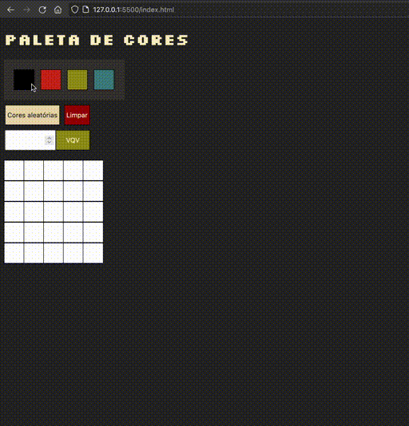
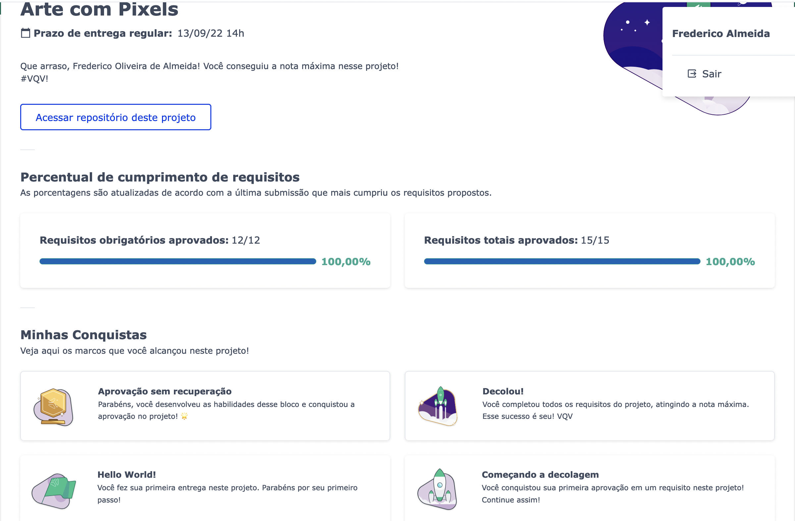

# Demo
### https://vrkknn.net/projects/pixels-art/index.html

---

# Requisitos Obrigatórios
:warning: **Leia todos os requisitos atentamente e siga à risca o que for pedido. Em particular, **atente-se para os nomes de _ids_  e _classes_ que alguns elementos de seu projeto devem possuir**. Não troque `ids` por `classes` ou vice-versa** :warning:

## 1 - Adicione à página o título "Paleta de Cores".

  
A página deve conter o título "Paleta de Cores"
 

- O título deverá ficar dentro de uma tag `h1` com o `id` denominado `title`;

- O texto do título deve ser **exatamente** "Paleta de Cores".

**O que será testado:**

- O título deve possuir a tag `h1`;
- O título deve possuir o `id` `title`;
- O título deve ser `Paleta de Cores`.

## 2 - Adicione à página uma paleta contendo quatro cores distintas.

  
A página deve conter uma paleta com quatro opções de cores

- A paleta de cores deve ser um elemento com `id` denominado `color-palette`, e cada cor individual contida na paleta de cores deve possuir a `classe` chamada `color`;

- A cor de fundo de cada elemento da paleta deverá ser a cor que o elemento representa. **A única cor não permitida na paleta é a cor branca**;

- Cada elemento da paleta de cores deverá ter uma borda preta, sólida e com 1 pixel de largura;

- A paleta de cores deverá listar todas as cores disponíveis para utilização lado a lado, e deverá ser posicionada abaixo do título `Paleta de Cores`;

- A paleta de cores não deve conter cores repetidas.

**O que será testado:**

- A paleta de cores deve possuir o `id` `color-palette`;

- As cores individuais da paleta devem possuir a `classe` `color`;

- A cor de fundo de cada elemento da paleta é a cor que o elemento representa :warning: **A única cor não permitida na paleta é a cor branca** :warning:;

- Os elementos da paleta de cores devem ter borda preta, sólida e com 1 pixel de largura;

- As cores da paleta devem estar lado a lado;

- A paleta de cores deve estar posicionada abaixo do título `Paleta de Cores`;

- A paleta de cores não pode conter cores repetidas.

## 3 - Adicione a cor **preta** como a primeira cor da paleta de cores.

  
A primeira cor na paleta criada no requisito 2 deve ser preta. As demais cores podem ser escolhidas livremente. 
 

**O que será testado:**

- A primeira cor da paleta deve possuir `background-color ` preto;

## 4 - Adicione um botão para gerar cores aleatórias para a paleta de cores.

  
A primeira cor da sua paleta deve ser a cor preta, e as outras três cores devem ser geradas aleatoriamente ao clicar no botão.
 

**O que será testado:**

- O botão deve possuir o `id` denominado `button-random-color`;

- O botão deve possuir o texto `Cores aleatórias`;

- As cores geradas na paleta são diferentes a cada click do botão;

- A cor preta deve ser mantida como a primeira na sua paleta de cores.

## 5 - Implemente uma função usando localStorage para que a paleta de cores gerada aleatoriamente seja mantida após recarregar a página.

  
As cores da paleta de cores que foram geradas aleatoriamente devem ser mantidas após recarregar a página
 

**O que será testado:**

- A paleta gerada deve ser salva no localStorage com a chave `colorPalette`;

- A paleta gerada deve ser mantida ao recarregar a página.

## 6 - Adicione à página um quadro contendo 25 pixels.

  
Sua página deve conter um quadro de pixels 5x5

- O quadro de *pixels* deve ter 5 elementos de largura e 5 elementos de comprimento;

- O quadro de *pixels* deve possuir o `id` denominado `pixel-board`, e cada *pixel* individual dentro do quadro deve possuir a `classe` denominada `pixel`;

- A cor inicial dos *pixels* que compõem o quadro de pixels deve ser branca;

- O quadro de *pixels* deve aparecer abaixo da paleta de cores.

**O que será testado:**

- O quadro de *pixels* deve possuir o `id` `pixel-board`;

- Cada pixel individual dentro do quadro deve possuir a `classe` `pixel`;

- A cor inicial dos *pixels* dentro do quadro deve ser branca;

- O quadro de *pixels* deve aparecer abaixo da paleta de cores.

## 7 - Faça com que cada pixel do quadro tenha largura e altura de 40 pixels e borda preta de 1 pixel de espessura.

  
Cada <code>pixel</code> do quadro deve possuir 40px de largura e 40px de altura e uma borda preta sólida de 1px de espessura
 

**O que será testado:**

- O quadro de *pixels* deve possuir altura e comprimento de 5 elementos;

- Os elementos do quadro devem possuir 40 px de altura e 40 px de largura, incluindo o seu conteúdo e excluindo a borda preta;

- Os elementos do quadro devem possuir borda preta sólida de 1px de espessura.

## 8 - Defina a cor preta como cor inicial da paleta de cores

  
A cor preta já deve estar selecionada na paleta para pintar os pixels do quadro ao iniciar a página.

- O elemento que posteriormente deverá receber a classe selected deve ser um dos elementos que possuem a classe color, como especificado no requisito 2.

- O elemento da cor preta deve possuir inicialmente a classe `selected`.

**O que será testado:**

- O elemento da cor preta possui, inicialmente, a classe `selected`;

- Nenhuma outra cor da paleta pode ter a classe `selected` ao carregar a página.

## 9 - Crie uma função para selecionar uma cor na paleta de cores e preencha os pixels no quadro.

  
A cor clicada deve ser selecionada e poderá ser utilizada para preencher os quadros

- A cor clicada deve receber a `classe` `selected` e a cor previamente selecionada deve perder esta `classe`;

- Somente uma das cores da paleta pode ter a classe `selected` de cada vez;

- Os elementos que deverão receber a `classe` `selected` devem ser os mesmos elementos que possuem a classe `color`, como especificado no **requisito 2**.

**O que será testado:**

- Somente uma cor da paleta de cores pode ter a classe `selected` de cada vez;

- Os pixels dentro do quadro não devem ter a classe `selected` quando são clicados.

## 10 - Crie uma função que permita preencher um pixel do quadro com a cor selecionada na paleta de cores.

  
O <code>pixel</code> do quadro clicado deve ter sua cor alterada para a cor selecionada na paleta de cores
 

**O que será testado:**

- Ao carregar a página deve ser possível pintar os pixels do quadro de preto;

- Após selecionar outra cor na paleta de cores, é possível pintar os pixels do quadro com essa cor;

- Somente o pixel que foi clicado deve ter a cor alterada, sem influenciar na cor dos demais pixels.

## 11 - Crie um botão que retorne a cor do quadro para a cor inicial.

  
Sua página deve ter um botão que, ao ser clicado, deixe todos os <code>pixels</code> do quadro com a cor branca
 

**O que será testado:**

- O botão deve possuir o `id` `clear-board`;

- O botão deve estar posicionado entre a paleta de cores e o quadro de pixels;

- O botão deve possuir o texto `Limpar`;

- O botão ao ser clicado, deve deixar todos os pixels do quadro preenchidos de branco.

## 12 - Crie uma função para salvar e recuperar o seu desenho atual no localStorage

  
Os pixels, ao serem clicados, devem ter sua cor e posição salvas no localStorage. Quando recarregar a página, o quadro deve ser recuperado a partir do que foi salvo no localStorage.
 

**O que será testado:**

- Os pixels pintados devem ser salvos no localStorage com a chave `pixelBoard`;

- O quadro deve ser preenchido com as mesmas cores utilizadas anteriormente, nas posições corretas ao recarregar a página

# Requisitos Bônus

## 13 - Crie um input que permita à pessoa usuária preencher um novo tamanho para o quadro de pixels.

  
A página deve conter um input para que a pessoa usuária possa definir o tamanho do quadro de pixels

- Crie um input com `id` `board-size` posicionado entre a paleta de cores e o quadro de pixels para receber um valor maior que zero para definir o tamanho do quadro de pixels.

- Crie um botão que deve conter o texto "VQV" e `id` `generate-board`;

- O botão deve estar posicionado ao lado do input;

- O botão, ao ser clicado, deve alterar o tamanho do quadro para **N** pixels de largura e **N** pixels de altura, em que **N** é o número inserido no input. Ou seja, se o valor passado para o input for igual a 7, ao clicar no botão, será gerado um quadro de 49 pixels (7 pixels de largura x 7 pixels de altura);

- O input só deve aceitar número maiores que zero. Essa restrição **deve** ser feita usando os atributos do elemento `input`;

- Se nenhum valor for colocado no input ao clicar no botão, mostre um `alert` com o texto: "Board inválido!";

- O novo quadro deve ter todos os pixels preenchidos com a cor branca.

- O quadro salvo no localStorage deve ser apagado.

**O que será testado:**

- O input deve possuir o `id` `board-size`;

- O input deve aceitar apenas números maiores que zero. Essa restrição deve ser feita usando os atributos do elemento `input`;

- O input deve estar posicionado entre a paleta de cores e o quadro de pixels;

- O botão deve possuir o `id` `generate-board`;

- O botão deve possuir o texto `VQV`;

- O botão deve estar posicionado ao lado direito do input;

- O botão, ao ser clicado, deve mudar o tamanho do board usando o valor do input;

- O botão, ao ser clicado sem valor definido no input, deve emitir um `alert` com o texto: `Board inválido!`;

- O quadro gerado deve ter todos os pixels preenchidos com a cor branca.

## 14 - Crie uma função que limite o tamanho mínimo e máximo do quadro de pixels.

  
O quadro não pode ser definido com menos de 5 ou mais de 50 <code>pixels</code>

- Caso o valor digitado no input `board-size` esteja fora do intervalo de 5 a 50, faça:

  1. Para um valor de `board-size` menor que 5, considere 5 `pixels` como o valor padrão;

  2. Para um valor de `board-size` maior que 50, considere 50 `pixels` como o valor padrão.

**O que será testado:**

- A altura do board pode ser igual a 50;

- A altura do board é 5 pixels quando um valor menor que 5 é colocado no input;

- A altura do board é 50 pixels quando um valor maior que 50 é colocado no input.

## 15 - Crie uma função para manter o tamanho novo do board ao recarregar a página.

  
O tamanho do board deve ser mantido ao recarregar a página usando localStorage
 

**O que será testado:**

- O tamanho do board gerado deve ser salvo no localStorage com a chave `boardSize`;

- O quadro deve ter o mesmo tamanho gerado ao recarregar a página.

